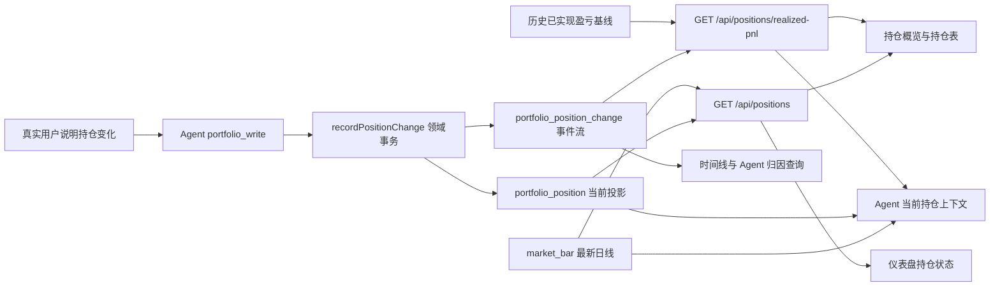

# 实时持仓链路精简评审说明

> 文档状态：已实施并验证  
> 评审对象：产品、研发、测试、运维  
> 最后更新：2026-08-26

## 一、最终结论

- 持仓变化只通过 `portfolio_write.record_position_change` 进入持仓 service。
- `portfolio_position_change` 保存持仓事件和归因，`portfolio_position` 保存当前持仓投影，`market_bar` 只派生估值。
- 总资金、可用资金、账户快照和快照锚定口径退出生产读写；累计已实现盈亏改由一次性历史基线与后续卖出事件维护。
- Agent 继续具备当前持仓读取、组合持仓汇总、累计已实现盈亏、历史归因查询、策略分析和受控持仓写入能力。
- 旧快照表及存量数据不物理删除，只作为历史数据由完整私有备份保留，并向 Agent 隐藏。

## 二、当前链路

### 2.1 写入契约

| 事件 | 最终行为 |
|---|---|
| `buy` | 新建持仓，或按数量加权更新成本 |
| `sell` | 校验不超卖；固化卖出前成本和本笔已实现毛盈亏；部分卖出只减数量，全部卖出删除当前持仓行 |
| `adjust` | 修正真实用户确认的数量或成本 |
| `note` | 只追加归因事件，不改变当前持仓 |

事件和当前投影在同一事务中维护。写入继续保留确认制、YOLO、状态指纹、写锁、审计和页面刷新机制；Agent 不获得通用 SQL 写权限。

### 2.2 读取契约

| 数据 | 事实来源 | 使用方 |
|---|---|---|
| 数量、成本、开仓日期 | `portfolio_position` | 页面、Agent、任务 |
| 持仓市值、浮动盈亏、收益率 | 当前持仓与最新 `market_bar` | 页面、Agent |
| 持仓数、组合市值、组合浮盈、行情缺口 | 同一批当前持仓结果汇总 | 页面、Agent |
| 累计已实现盈亏、卖出笔数、缺口笔数 | 一次性历史基线 + 基线后卖出事件 | 页面、Agent |
| 变动原因、决策来源、执行符合度、策略哈希、计划和偏离原因 | `portfolio_position_change` | 时间线、Agent 查询 |

存在行情缺口时，组合市值和浮动盈亏必须明确标记为不完整；存在无法还原成本的卖出时，累计已实现盈亏也必须标记为不完整。两类收益均不得猜测，已实现盈亏统一标明未计手续费和税费。

## 三、Agent 能力边界

| 能力 | 当前契约 |
|---|---|
| 当前持仓认知 | 每轮获得标的、数量、成本、最新收盘日期、市值、浮动盈亏和收益率 |
| 组合概览 | 获得持仓市值、浮动盈亏、持仓数和行情缺口 |
| 已实现盈亏 | 获得历史基线、基线后卖出事件汇总和缺口状态；明确未计费用 |
| 历史归因 | 可通过结构化只读查询访问 `portfolio_position_change` |
| 持仓维护 | 可生成买入、卖出、调整和备注提案，并经持仓 service 执行 |
| 策略分析 | 继续结合当前策略、行情、标的池、计划、分析和回测结果工作 |
| 账户指标问答 | 总资金和可用资金明确说明没有可对账数据源；累计已实现盈亏使用事件化汇总，不读取旧账户表、不猜测缺口 |

`portfolio_write` 保留原工具名，只删除账户快照 action，避免重建确认、审计和并发控制链路。每日计划提示词只读取 `portfolio_position` 和 `portfolio_position_change`，并使用“组合持仓结构和风险”口径。

## 四、接口与页面

| 项目 | 当前契约 |
|---|---|
| `GET /api/positions` | 保持返回当前持仓及最新行情派生指标 |
| `GET /api/positions/changes` | 保持返回带归因的持仓事件流 |
| `GET /api/positions/realized-pnl` | 返回历史基线、后续卖出事件汇总、卖出笔数、缺口笔数与未计费用状态 |
| `GET /api/account/snapshots` | 已退役，返回 404 |
| `GET /api/account/summary` | 已退役，返回 404 |
| 持仓页 | 展示持仓概览、累计已实现盈亏、持仓表、归因构成和变化时间线；卖出行展示本笔收益与成交前成本 |
| 归因说明 | 使用“查看详情”按钮和自定义悬浮层，支持鼠标、键盘和触屏焦点，不使用原生提示 |
| 仪表盘 | 展示持仓状态、任务与行情异常、近期关注，不展示账户或快照语义 |

## 五、历史数据边界

- `portfolio_account_snapshot`、`portfolio_account_state`、`portfolio_position_snapshot_daily` 停止生产读写。
- 三张表加入 `HIDDEN_LEGACY_TABLES`，不进入 Agent 表索引，也不能通过 Agent 描述或查询。
- 0043 只把 `portfolio_account_state.closed_pnl` 固化为一次性历史基线；运行时不再读取旧账户表，也不改名或 `DROP` 历史表。
- 完整私有备份继续保留全库；Git 固定资产包仍排除全部 `portfolio_*` 个人运行数据。
- 物理删除旧表或个人历史数据必须另行取得真实用户确认并新增只向前迁移。

## 六、实现结果

- 持仓 service 不再联动账户快照、资金摘要或快照锚定现金；卖出事件原子维护本笔已实现盈亏。
- Agent 参数校验、状态指纹、确认预览和执行分支只保留持仓事件写入。
- 账户快照与资金摘要 HTTP 路由、前端类型和快照图表组件已删除。
- 持仓页使用当前持仓、持仓事件、行情和一次性历史基线可验证的指标；仪表盘继续只使用当前持仓与行情。
- `0041_agent_flow_position_facts.sql` 追加每日计划提示词修订，不改写已应用迁移或历史提示词版本。

## 七、验收结论

| 范围 | 结论 |
|---|---|
| 服务端与 Agent | TypeScript 类型检查通过；持仓、Agent 工具、确认、迁移和数据卷相关测试通过 |
| 完整回归 | `npm test` 通过，12 个测试文件共 131 个用例全部通过 |
| 前端 | Vue 类型检查与生产构建通过 |
| 移动端 | 390x844 下整页、持仓卡和 Agent 面板无横向溢出；归因浮层位于业务区内 |
| 桌面端 | 1280x800 下整页无横向溢出；归因浮层不遮挡右侧 Agent 工作区 |
| 退役接口 | 两个旧账户接口均返回 404 |
| 代码质量 | `git diff --check` 通过，无新增依赖或替代资金抽象 |

## 八、评审结论

- 结论：通过。
- 当前系统采用单一实时持仓链路，不再维护账户快照或快照锚定资金状态。
- Agent 的可验证持仓读写、累计已实现盈亏、归因和策略分析能力保持；无法验证的总资金、可用资金与收益缺口明确退出能力边界。
