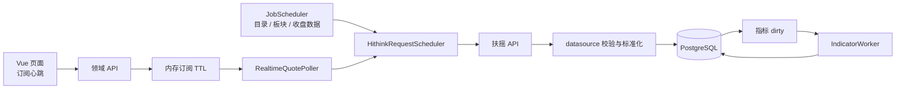

# 自选行情与智能助手增强：行情运行时与指标设计

> 文档状态：待评审
> 所属方案：自选行情与智能助手增强
> 主评审入口：[技术设计评审说明](自选行情与智能助手增强技术设计评审说明.md)
> 评审对象：服务端、数据源、测试、运维
> 最后更新：2026-08-19

## 一、职责与边界

本文负责扶摇请求调度、目录和板块同步、近实时轮询、每日市场结构同步、指标公式与计算一致性。

**不变边界**

- 扶摇是本仓库第一优先行情源；所有请求至少间隔 3 秒，并检查 HTTP 状态和响应 `code==0`。
- 扶摇没有分钟 K、tick、Level-2、港美股、期货和个人券商数据；盘中采样不得被解释成分钟 K。
- 外部数据必须由 datasource 校验并落库后再由页面或 Agent 读取。远程搜索候选是唯一允许短暂直出的数据。
- 生产指标由 TypeScript 计算，不引入 Python 运行依赖。

数据表职责见[数据模型与迁移设计](自选行情与智能助手增强_数据模型与迁移设计.md)，页面状态与接口见[前端交互与接口设计](自选行情与智能助手增强_前端交互与接口设计.md)。

## 二、运行时结构



`RealtimeQuotePoller` 和 `IndicatorWorker` 与现有 `JobScheduler` 一样由 `server/index.ts` 启停。关闭顺序为：停止新订阅和新指标领取，等待当前网络批次与短事务收敛，停止调度器，最后关闭 HTTP 和连接池。

轮询器和指标工作器均使用 PostgreSQL advisory lock 保证多进程单实例执行，但网络请求不包在数据库事务中。

## 三、标的目录与板块同步

### 3.1 类型解析

```typescript
type InstrumentKind = "stock" | "etf" | "index" | "board" | "fund" | "futures";
type SourceAssetType =
  | "a-share" | "a-share-index"
  | "fund-etf" | "fund-lof" | "fund-otc"
  | "internal-futures";
```

- `a-share` → stock。
- `fund-etf` → etf；`fund-lof/fund-otc` → fund。
- `internal-futures` → futures。
- `a-share-index` 若存在于四类板块目录则为 board，否则为 index。
- `.TI` 只允许 index/board 的快照与历史路由；`.OF` 不走 SH/SZ/BJ 交易所校验。
- `ensureInstrument` 改为接收完整 `InstrumentIdentity`；除内部期货外不再根据行情频率猜类型。

### 3.2 目录同步步骤

1. 请求行业、概念、区域、特色四类板块目录，建立 `.TI` 板块集合。
2. 分页请求完整标的目录；适配器将每页大小限制在官方上限内。
3. 校验标准代码、名称、asset type 和币种；未知类型进入 gaps，不自动扩充枚举。
4. 以 code 幂等 upsert；改名前先写 alias。只有全量批次完整成功后，才把本批未出现的标的标为 inactive。
5. 每个请求写 `market_fetch_run`，作业整体状态由 `job_run` 汇总。

目录默认每日一次。本地搜索不足时可以调用远程搜索；加入自选前由服务端按精确 code 再查一次并完成校验，网络请求完成后才进入短事务。

### 3.3 板块成分

- 目录请求优先级为 `scheduled-medium`，全量成分为 `scheduled-low`。
- 当前页面正在查看且数据过旧的板块可触发 `interactive` 单板块刷新，同一板块 10 分钟内去重。
- 全量任务按 board type 和 code 把游标保存在 `job_run.artifacts`；重试从未完成板块继续。
- 行业优先于概念、区域和特色。如果容量探测证明一个交易日无法完整同步，任务必须标记 partial，并回到产品评审同步频率。
- 只有完整响应参与成分差异；异常空响应等同失败，不关闭旧关系。

板块收盘行情写 `market_bar(kind='board', freq='day')`，板块盘中快照写 `market_quote_*`。

## 四、扶摇统一请求调度器

`HithinkRequestScheduler` 只有一个并发槽，所有数据适配器共用同一队列。优先级为：

```text
interactive（搜索、单板块刷新）
  > realtime（当前页面行情）
  > scheduled-medium（日线、特色数据、目录）
  > scheduled-low（全量板块成分）
```

为避免低优先级饥饿，高优先级连续执行 5 次后，至少放行 1 个已经等待的低优先级请求。所有重试重新排队并再次遵守最小间隔。

| 供应商结果 | 处理 |
|---|---|
| HTTP 成功且 `code==0` | 继续解析与业务校验 |
| HTTP 429 或 `code=4001` | 遵守 Retry-After 或指数退避，记录排队与限流 |
| `code=2001/2003` | 立即失败为未认证或权限不足，不批量重试 |
| 响应字段或日期不匹配 | 标记数据失败，不把 HTTP 200 当作成功 |

调度器记录 `priority`、`queued_delay_ms`、实际请求耗时、重试次数和终态。错误不得暴露 API Key、完整 URL 或供应商响应头。

## 五、近实时轮询

### 5.1 订阅和优先级

前端每 30 秒上报 `client_id`、当前可见 codes 和 view；服务端仅在内存保存 90 秒 TTL。每个 cycle 依次构造：

1. 活跃页面订阅中的主标的和对比项。
2. focused 自选。
3. 其余自选。
4. 显式要求盘中跟踪的系统基准。

去重后按 stock、index/board、etf 分组。股票、指数和板块使用批量端点；ETF 按官方单只端点串行。目标周期内没有完成的低优先级标的延后到下一 cycle，不重叠启动新 cycle。

### 5.2 交易时段

轮询器仅在 `market_trading_day.is_open=true` 且上海时区指定窗口运行：

- 集合竞价观察窗口的起点由第零阶段真实探测决定。
- 09:30—11:30、13:00—15:00 正常轮询。
- 午休返回 `break`，非交易日和收盘后返回 `closed`。
- 15:05 执行一次收盘确认。

D3 若采用建议值，有活跃订阅时目标周期 60 秒；没有前台订阅时，focused 和其余自选最多每 5 分钟。周期是容量目标，不是交易所 SLA；页面必须展示实际行情时间、抓取时间、覆盖率与新鲜度。

### 5.3 落库和推送

- 相同 `quote_time` 的修订更新 latest 和同一 sample；更早时点不得覆盖 latest。
- 部分代码失败时保留旧值并转为 delayed/partial，失败点不写 sample。
- SSE 只推当前订阅 codes 的新批次、批次时间和 coverage，每 25 秒 heartbeat。
- SSE 不保留历史重放；重连先重新 GET latest 和当日 series。
- 对比百分比在服务端按 `(last / prev_close - 1) * 100` 计算；缺口返回 null，前端不连接空点。

## 六、每日行情与市场结构

调度器 datasource config 只接受以下白名单 pipeline：

```typescript
type DatasourcePipeline =
  | "daily_market_update"
  | "market_catalog_sync"
  | "board_membership_sync"
  | "daily_market_structure";
```

| 作业 | 建议时点 | 内容 |
|---|---|---|
| `daily_market_update` | 收盘后 | 持仓、策略角色、自选、系统基准和关联板块日线 |
| `daily_market_structure` | 15:35 后 | 涨停、跌停、炸板、连板、龙虎榜 all/org/hot_money |
| `market_catalog_sync` | 每交易日一次 | 交易日历、标的目录和四类板块目录 |
| `board_membership_sync` | 目录完成后 | 当前板块成分，支持游标和部分成功 |

涨跌停和炸板显式传上海零点 `date_ms`，按 size=200 分页并校验 page/pages/total；龙虎榜显式传 `yyyy-MM-dd`。不得依赖供应商默认“最近可用日”。完成页数小于声明页数时，整个 dataset 为 partial；成功页保留，补跑保持幂等。

## 七、指标公式

首期计算版本命名为 `正式日线指标一版`，稳定标识同时写入代码常量和 run。公式精确对齐正式引擎 `ta 0.11.0`：

```text
SMA(n)：当前及前 n-1 个有效 close 的算术平均；不足 n 行返回 NULL。

EMA(n)：alpha = 2 / (n + 1)。首个有限输入作为内部 seed，之后
y[t] = alpha*x[t] + (1-alpha)*y[t-1]。
内部从第一行递推，累计有限输入少于 n 时对外返回 NULL，等价于
pandas ewm(span=n, min_periods=n, adjust=False)。

DIF = EMA(12) - EMA(26)。
DEA = EMA(9) 作用于有效 DIF。
MACD柱 = DIF - DEA，不乘 2。
```

输入按 `bar_date, bar_time` 升序，复合主键不得重复。股票日线要求 `adjustment='forward'`；指数、板块和 ETF 要求明确为 `none`。复权未知、OHLC 非法、顺序重复或抓取审计存在未解决 gap 时，run 标为 untrusted，API 默认不返回指标值。

停牌导致的自然缺行本身不判错，因为当前数据源不能可靠区分停牌和抓取缺口。

## 八、指标计算与切换

### 8.1 脏标记和全量重算

`storeBars` 在行情 upsert 同一事务内合并 dirty：`earliest_date=LEAST(old,new)`，`generation=generation+1`。指标工作器：

1. 领取一项 dirty 并获取单序列 advisory lock。
2. 在 repeatable read 中读取完整有序行情，计算输入 SHA-256。
3. 在事务外执行纯函数计算。
4. 新事务确认 dirty generation 未变化；变化时放弃本次结果并重排。
5. 原子替换当前值、写 run 并清 dirty。
6. 失败时写 failed run、保留 dirty 并退避重试。

首期始终全历史复算，不从 `earliest_date` 接续 EMA 状态。规模证据证明必要前，不引入检查点优化。

### 8.2 从旧 MA 切换

1. `0025` 建表并把 day/futures_day 全量标 dirty，旧 MA 继续提供读取。
2. 回填后影子比较新 MA、旧 MA 和正式引擎金样本。
3. `INDICATOR_V2_READ` 切换到新表；页面返回计算版本和 status，旧 `recomputeMa` 只在过渡期双算。
4. 连续 5 个交易日无超容差差异后，删除双算和开关；另发迁移删除 `market_bar.ma5/10/20/60`。

兼容窗口必须有明确退出日，不能长期保留两个权威来源。

### 8.3 金样本与容差

- 永久保留一个紧凑夹具 `tests/fixtures/指标金样本.json`，覆盖股票、ETF、指数、数据不足和历史修订。
- 夹具记录 ta/pandas 版本、输入 SHA 和生成说明。
- TypeScript 容差为 `abs(actual-ref) <= 1e-10 + 1e-9 * abs(ref)`；NULL 位置必须完全一致。
- 一次性生成或容量探测脚本验证后删除，生产不调用 Python。

## 九、失败状态

| 失败 | 持久化和对外状态 |
|---|---|
| 单板块成分失败 | 保留上一完整关系，该板块记录 gap |
| 特色数据分页失败 | 成功页保留，dataset=partial |
| 近实时部分失败 | 保留旧 latest，状态 delayed/partial，不写失败 sample |
| 指标计算失败 | 旧 run 保留但 API 标 stale，dirty 不清 |
| 多实例未取得 poller lock | 本 cycle 记 skipped，不算数据失败 |

## 十、计划验证

| 验收行为 | 计划验证方式 | 观察信号 |
|---|---|---|
| 完整目录分页 | fake 多页和一次真实只读容量探测 | 每类源/库计数一致，未知类型进入 gaps |
| 请求队列公平性 | 虚拟时钟压入四级优先级和 429 | 全局间隔满足要求，低优先级不饥饿 |
| 交易时段 | 虚拟交易日、午休、休市和订阅 TTL | 前台/后台优先级及 break/closed 准确 |
| 快照覆盖率 | 模拟批量部分失败、ETF 串行和 cycle 超时 | coverage 可解释，低优先级不重叠执行 |
| 特色数据分页 | 三页、第二页失败、重放和非交易日 | partial/成功准确，重复同步零重复 |
| 指标公式 | 永久金样本比较 MA/DIF/DEA/hist | 数值无超容差差异，NULL 位置完全一致 |
| 指标历史修订 | 计算中改变 generation | 旧计算不提交，最终值等于全量重算 |

## 十一、专题风险与回退

| 风险 | 缓解 | 回退 |
|---|---|---|
| 板块全量同步超过交易日窗口 | 真实容量探测、低优先队列、游标续跑 | 保留上一完整关系，由产品重新确认同步频率 |
| 近实时挤占收盘任务 | 高优先连续 5 次后公平放行 | 关闭 `REALTIME_MARKET_ENABLED`，收盘作业继续 |
| JS 指标初始化偏离正式引擎 | 金样本、影子对账、混合容差 | 保持旧 MA 读取，修复后全量回填 |
| 复权未知导致指标不可用 | 补齐口径或重拉，明确显示 untrusted | 保留原始 K 线并隐藏指标，不猜测数值 |
| 盘中样本被误用于策略 | 物理隔离、工具和 Schema 标注 | 关闭样本查询工具，审计调用；不影响 `market_bar` |
