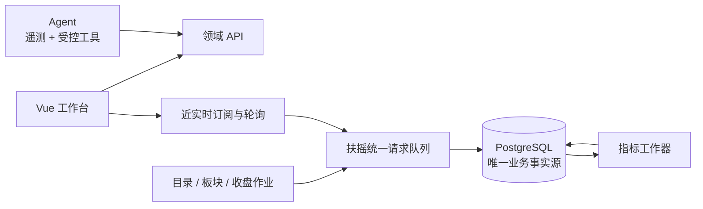

# 自选行情与智能助手增强技术设计评审说明

> 文档状态：待评审
> 评审对象：产品、服务端、前端、测试、安全与运维
> 事实来源：`Stock_自选行情与智能助手增强_产品需求_v1.0.md`、`Stock_策略演进系统_技术设计_v2.0.md`、当前 `project/server/` 与 `project/web/` 代码、扶摇官方接口文档、正式回测引擎
> 最后更新：2026-08-19

## 一、评审摘要

- **目标：** 在不破坏 PostgreSQL 单一事实源、策略发布真人门禁和既有交易事实的前提下，完成全市场标的发现、统一自选、板块自动分组、盘中近实时观察、每日市场结构、可信指标计算和智能助手效率增强。
- **核心方案：** 完整标的目录作为统一入口，自选主关系与自定义分组关系拆开；板块使用有效期成分模型；盘中快照与日线物理分离；TypeScript 指标服务对齐正式回测引擎。Agent 先补运行指标，再以固定评测决定是否启用领域工具。
- **主要影响：** 新增 `0022`—`0028` 七个只向前迁移、四个服务端领域模块、近实时轮询器、指标工作器、自选和行情页面重构、ECharts 标注层及 Agent 遥测。
- **本次需要确认：** D1—D6 六项产品选择，以及本文的迁移、轮询、指标、Agent 工具和分阶段发布方案。未确认前只允许执行只读容量探测、指标金样本对账和 Agent 基线评测。

## 二、背景与目标

### 2.1 背景

【事实】当前 `/api/instruments` 只搜索本地 `market_instrument`；`watchlist_item` 把自选和手工分组绑定在同一行；`market_instrument.sector_code` 只能表达单一板块；行情页只读取 `market_bar` 并展示 K 线、成交量和 MA。现状适合已入库标的的盘后研究，不支持完整目录、多板块归属和持续盘中观察。

【事实】扶摇支持标的列表与检索、A 股/指数/同花顺板块/ETF 快照、四类板块目录与当前成分、交易日历、涨跌停、炸板、连板和龙虎榜；不提供分钟 K、tick、Level-2、港美股、期货和个人券商数据。跨请求必须至少间隔 3 秒。

【方案】供应商接口不直接暴露给页面或 Agent。除未落库标的的短暂搜索候选外，行情、板块、特色数据和指标都必须经 datasource 校验并写入 PostgreSQL 后读取。

### 2.2 目标与验收

| 目标 | 可观察的验收信号 | 来源 |
|---|---|---|
| 完整标的发现 | 本地未入库但供应商可检索的标的可以消歧并幂等加入自选 | 【已确认】PRD 1、7.1 |
| 自选只维护一次 | 同一标的只有一条自选主关系，可同时出现在关注、板块和多个自定义分组 | 【已确认】PRD 2、7.2 |
| 板块关系可追溯 | 四类板块和成分带来源批次、截止时间和有效期；失败不覆盖上一完整版 | 【已确认】PRD 5、7.3 |
| 近实时不冒充交易所实时 | 最新值包含行情时间、抓取时间、来源和新鲜度；断流后转 delayed | 【已确认】PRD 3、7.4 |
| 对比和画线可靠 | 按前收归一，缺口不连接，标注按数据坐标保存并恢复 | 【已确认】PRD 4、7.5 |
| 市场结构可复查 | 涨跌停、炸板、连板和龙虎榜按目标交易日幂等同步并显示完成度 | 【已确认】PRD 6、7.6 |
| 指标与正式引擎一致 | MA、DIF、DEA、`DIF-DEA` 金样本无超容差差异 | 【已确认】PRD 8、7.7 |
| Agent 优化有证据 | 固定评测比较 token、轮次、时延和事实完整度；无收益工具不启用 | 【已确认】PRD 7、7.8 |

### 2.3 范围边界

**范围内**

- A 股、标准指数、同花顺板块、ETF 和基金目录的同步、检索、能力标记和按需建档。
- 统一自选、关注状态、自定义分组、板块动态视图和标的池角色兼容。
- 近实时快照与采样、对比图、基础画线、市场结构和可信日线指标。
- Agent 运行指标、固定评测、候选领域只读工具及 Web Provider 安全契约。

**范围外**

- tick、Level-2、交易所直连、自动下单、券商接口、港美股和真实分钟 K。
- 用盘中采样生成日线信号、分钟 K 或回测输入。
- 用当前板块成分反推历史关系，或自动把画线、网页和市场特色数据发布为策略。
- D6 和供应商未确认前实现通用 Web 搜索。
- 本轮实施产品代码、数据库迁移或根目录交易文件变更。

## 三、现状与约束

| 事实或约束 | 证据位置 | 对方案的影响 |
|---|---|---|
| 【事实】迁移只向前执行，当前最新为 `0021` | `server/db/migrate.ts`、`server/migrations/0021_chat_first_agent_jobs.sql` | 新结构从 `0022` 起追加，历史迁移不改 |
| 【事实】`market_instrument.kind` 缺少 board/fund，且只有单值 `sector_code` | `server/migrations/0002_core.sql` | 需要显式类型和多对多板块关系 |
| 【事实】`ensureInstrument` 除期货外默认登记 stock | `server/datasource/service.ts` | 必须按供应商资产类型解析，不再按频率猜测 |
| 【事实】删除自选组会级联删除当前条目 | `server/migrations/0002_core.sql`、`modules/watchlist/repo.ts` | 自选主关系和分组关系必须拆表 |
| 【事实】扶摇请求共用至少 3 秒间隔和退避 | `server/datasource/ratelimit.ts`、`hithink.ts` | 目录、轮询和收盘任务必须共用公平队列 |
| 【事实】调度器是 5 段 cron 和 30 秒 tick | `server/scheduler/` | 盘中差异化轮询使用独立运行时，收盘同步仍走任务系统 |
| 【事实】`market_bar` 同时存 OHLC 和 MA | `server/migrations/0002_core.sql`、`modules/market/repo.ts` | 指标切换必须有影子对账和旧来源退出窗口 |
| 【事实】正式回测使用 `ta 0.11.0` 和 pandas adjust=false EMA | `支撑/backtest/portfolio_engine.py`、本地 `ta/utils.py` | TypeScript 必须复刻初始化和空值规则 |
| 【事实】K 线组件未暴露坐标转换能力 | `web/src/components/KlineChart.vue` | 画线需要受控图表 controller 和独立标注层 |
| 【事实】Agent 已能取得实际 usage | `pi-ai/types.d.ts`、`agent/core/loop.ts` | 可直接补遥测，无需引入新 SDK |

## 四、方案总览

### 4.1 核心思路

- **目录、关注、分组和策略角色分层：** `market_instrument`、`watchlist_entry`、`watchlist_group_membership`、`pool_membership` 各自只有一个职责。
- **盘中与收盘事实分离：** 近实时写 `market_quote_*`，收盘日线写 `market_bar`，两者没有覆盖路径。
- **原始行情与指标分离：** 指标写独立 current/run/dirty 表，`market_bar` 的旧 MA 在稳定切换后退出。
- **作业与交互轮询分离：** 目录、板块和特色数据走可审计作业；近实时由订阅优先级驱动。
- **Agent 先观测再增强：** 固定评测证明收益后，才通过开关注册领域工具。

### 4.2 关键结构

### 4.3 影响面

| 影响面 | 变化 | 不变边界 |
|---|---|---|
| 数据库 | 新增目录元数据、板块、统一自选、快照、特色数据、指标、标注和遥测 | PostgreSQL 单一事实源，历史迁移只向前 |
| datasource | 增加元信息、板块、特色数据适配和统一请求队列 | 扶摇错误码、API Key 和显式降级规则不变 |
| 运行时 | 新增近实时轮询器和指标工作器 | 服务仍绑定 127.0.0.1，安全关闭后再断连接池 |
| 前端 | 自选、行情、市场结构和画线改造 | Agent 工作区、主题、消息中心和主布局不变 |
| Agent | 新增运行指标和候选只读工具 | 写工具、确认制、YOLO 和真人发布门禁不变 |
| 备份 | 完整备份自动包含新表；初始化包调整白名单 | API Key、聊天、确认、持仓等既有排除规则不变 |

## 五、关键决策

| 决策问题 | 选择 | 备选方案 | 选择理由 | 影响与代价 |
|---|---|---|---|---|
| 标的目录 | 【方案】定时镜像完整目录，本地优先，远程搜索补时差 | 每次远程查；只按需建档 | 搜索稳定且低延迟 | 增加目录同步和类型映射 |
| 指数与板块 | 【方案】板块使用 `kind='board'` 和扩展表 | 全部 index；独立代码表 | 能力和成分语义不同 | 更新所有类型分支 |
| 自选唯一性 | 【方案】entry 与分组关系拆表 | 旧表加 focused；视图去重 | 从数据层消除重复和级联误删 | 需要事务迁移和兼容切换 |
| 板块历史 | 【方案】有效期关系，成功批次才开闭 | 每日全量快照；只保留当前 | 可追溯且避免每日复制 | 查询需处理有效区间 |
| 近实时运行位置 | 【方案】独立 poller，按订阅和关注分级 | cron；浏览器直连 | cron 不表达前后台，直连产生双事实源 | 增加生命周期和锁 |
| 供应商限流 | 【方案】单一优先级公平队列 | 各模块独立限流；FIFO | 避免越限和低优先级饥饿 | 需要队列指标和容量验证 |
| 盘中存储 | 【方案】latest + sample，绝不写 `market_bar` | 覆盖日线；伪装分钟 K | 数据语义完全不同 | 增加保留期清理 |
| 市场域锁 | 【方案】市场命名锁，不占全局业务写锁 | 继续全局锁；无锁 | 长任务不能阻塞组合和策略写入 | 需要并发回归 |
| 指标存储 | 【方案】current + run + dirty，旧 MA 受控退出 | 继续扩 `market_bar`；通用窄表 | 原始与派生职责清晰 | 增加回填和短期双算 |
| MACD 口径 | 【方案】复刻 ta/pandas adjust=false，全历史复算 | JS 指标库；生产 Python | 避免初始化差异和 Python 依赖 | 保留一个必要金样本 |
| 图表画线 | 【方案】ECharts 坐标转换 + ZRender，保存数据坐标 | 新图表库；仅 markLine | 复用现有能力并支持拖动 | 需重构图表 controller |
| 特色数据 | 【方案】常用字段规范化，受限保存源 payload | 全 JSON；完全展开 | 兼顾查询和供应商变化 | 需要字段白名单和版本 |
| Agent 优化 | 【方案】先遥测和固定评测，再启用工具 | 直接注册；只改提示词 | 可证伪且控制权限面 | 第一阶段用户能力不变 |
| Web 研究 | 【方案】先定义只读 Provider 和安全契约 | 任意网页；完全不做 | 供应商、成本和注入风险尚未确认 | D6 后仍需独立实施设计 |
| D1 标的池导航 | 【待确认】只读兼容一版后移除导航，底层角色永久保留 | 立即删除；永久并列 | 保留对账与习惯迁移窗口 | 影响路由和验收周期 |
| D2 资产范围 | 【待确认】全部目录可检索/关注，完整行情覆盖股票、标准指数、板块和 ETF | 只做 A 股；扩港美股 | 与已核实数据能力一致 | fund 需显示能力不足 |
| D3 刷新周期 | 【待确认】前台 60 秒、后台 5 分钟作为容量目标 | 更快；仅手动 | 符合延迟容忍和 3 秒限流 | 实际周期受自选规模影响 |
| D4 采样保留 | 【待确认】最近 30 个交易日 | 仅当日；长期 | 支持短期复盘并控制体积 | 需要每日清理 |
| D5 画线范围 | 【待确认】水平线、趋势线和文字 | 再含矩形/斐波那契；不持久化 | 覆盖核心场景且控制复杂度 | 复杂标注后置 |
| D6 Web 范围 | 【待确认】官方/白名单站点，供应商另审 | 暂不启用；通用 Web | 先控制引用、安全和成本 | 未确认前不注册、不存凭据 |

## 六、专题设计索引

原 712 行单文档已拆成一个主评审入口和四份专题。每项规则只在其主责专题中维护，主文档只保留跨专题决策。

| 专题 | 负责内容 | 主要评审角色 |
|---|---|---|
| [数据模型与迁移设计](自选行情与智能助手增强_数据模型与迁移设计.md) | `0022`—`0028`、表结构、自选搬迁、板块有效期、备份恢复 | 服务端、数据、测试、运维 |
| [行情运行时与指标设计](自选行情与智能助手增强_行情运行时与指标设计.md) | 扶摇请求队列、目录/板块同步、近实时轮询、特色数据、指标公式与重算 | 服务端、数据源、测试、运维 |
| [前端交互与接口设计](自选行情与智能助手增强_前端交互与接口设计.md) | HTTP 契约、自选/行情/市场结构页面、SSE 状态和图表标注 | 产品、前端、服务端、测试 |
| [智能助手与发布验证设计](自选行情与智能助手增强_智能助手与发布验证设计.md) | Agent 遥测、评测门槛、领域工具、Web 安全、实施波次和回退 | 产品、服务端、测试、安全、运维 |

跨专题接口以数据库职责、HTTP 契约和功能开关为边界：数据专题定义事实归属，行情专题负责生产市场事实，前端专题只经 API 消费，Agent 专题只经领域 service 和受控工具访问。

## 七、实施与发布

| 阶段 | 交付边界 | 前置依赖 | 完成信号 |
|---|---|---|---|
| 第零阶段：证据基线 | Agent 指标、扶摇容量/权限探测、指标金样本和评测集 | 只读权限 | 可复现容量报告、Agent 基线和正式引擎金样本 |
| 第一阶段：目录与统一自选 | `0023/0024`、目录、板块关系、统一自选 service/UI | D1、D2 | 搜索到板块视图闭环，角色对账无差异 |
| 第二阶段：可信指标 | `0025`、工作器、影子对账和 API 切换 | 金样本满足容差 | 稳定期后删除双算 |
| 第三阶段：盘中观察 | `0026/0028`、请求队列、轮询、对比和画线 | D3—D5、容量报告 | 完整交易日覆盖午休、断流和恢复 |
| 第四阶段：市场结构 | `0027`、收盘作业和页面 | 特色接口权限和容量 | 连续五个交易日同步，补跑幂等 |
| 第五阶段：Agent 增强 | 领域工具按评测开启；Web 另立实施设计 | Agent 基线、D6 | 正确率不降且 token/轮次达标 |

发布使用 `UNIFIED_WATCHLIST_READ`、`INDICATOR_V2_READ`、`REALTIME_MARKET_ENABLED`、`MARKET_STRUCTURE_ENABLED` 和数据库 Agent 工具开关。同一发布不同时切换统一自选、指标和近实时三条主链路。

## 八、验收与验证计划

| 验收域 | 计划验证方法 | 观察信号 | 详细位置 |
|---|---|---|---|
| 目录、板块和自选 | 隔离迁移、fake 分页、真实容量探测、关系计数 | 无丢失、无重复、失败不覆盖上一版 | 数据、行情专题 |
| 近实时与市场结构 | 虚拟时段、公平队列、分页失败和完整交易日 | 新鲜度、coverage、partial 和补跑可解释 | 行情、前端专题 |
| 指标 | 正式金样本、历史修订和五日影子对账 | 数值无超容差差异，版本可追溯 | 行情专题 |
| 页面与画线 | 浏览器缩放、主题、刷新、断流和版本冲突 | 锚点不漂移，状态不误报，冲突不覆盖 | 前端专题 |
| Agent | faux usage、多工具 turn 和固定评测 A/B | 遥测准确、无正文落库、工具达到启用门槛 | Agent 专题 |
| 备份与恢复 | 新库完整恢复和初始化包恢复 | 包含表一致，排除表为空，派生可重建 | 数据、Agent 专题 |

所有内容均为计划验证，尚未实施或通过。测试优先扩展现有文件；指标只保留一个必要永久测试和紧凑金样本，容量探测、临时截图和一次性对账文件验证后删除。

## 九、风险与回退

| 风险 | 触发条件 | 缓解措施 | 回退或恢复 |
|---|---|---|---|
| 板块同步超过容量 | 板块数和 3 秒限流超出窗口 | 低优先队列、游标和容量报告 | 保留上一完整版，产品重新确认频率 |
| 自选搬迁丢关系 | 跨组重复或异常外键 | 事务内双计数和逐关系复制 | 回滚迁移；正式新写入后恢复迁移前快照 |
| 近实时挤占收盘任务 | 持续订阅占满队列 | 公平调度和覆盖率监控 | 关闭近实时，日线作业继续 |
| 指标偏离正式引擎 | EMA、NULL 或复权口径不同 | 金样本、全量重算和影子对账 | 保持旧 MA，修复后重新回填 |
| 盘中采样误用于信号 | 工具或查询把 sample 当分钟 K | 物理隔离和 Schema 标注 | 关闭样本工具并审计调用 |
| 标注上下文错位 | 复权或对比集合改变 | 服务端计算 context hash | 隐藏不匹配标注，保留副本 |
| Agent 遥测扩大隐私面 | 保存 prompt 或 result 明文 | 只存计数、时延、大小和哈希 | 关闭遥测并删除未授权行 |
| Web 提示注入 | 网页包含工具或策略指令 | 白名单、纯文本、域名重验和只读工具 | 关闭 Web 工具，数据库事实不受影响 |

## 十、待确认事项

- 【待确认】【产品/真实用户】D1：标的池页面是否按建议只读兼容一版后移除导航。
  - 影响：决定前端路由、回退窗口和验收周期；不影响 `pool_membership` 永久保留。
  - 建议：选择兼容一版，完成角色和评分对账后移除导航。
- 【待确认】【产品/真实用户】D2：完整目录均可检索和关注，但完整行情只覆盖股票、标准指数、板块和 ETF，是否接受。
  - 影响：决定 fund 的能力不足状态及 LOF/场外基金是否允许加入。
  - 建议：接受能力分层，避免把“可检索”误写成“有完整行情”。
- 【待确认】【产品/真实用户】D3：前台 60 秒、后台 5 分钟是否作为容量验证目标。
  - 影响：决定默认轮询参数、调用量和 delayed 阈值。
  - 建议：先按建议值探测；无法覆盖时回到评审，不静默放宽。
- 【待确认】【产品/真实用户】D4：盘中采样是否保留最近 30 个交易日。
  - 影响：决定清理任务、数据库增长和完整备份体积。
  - 建议：保留 30 个交易日；初始化包仍不包含采样。
- 【待确认】【产品/真实用户】D5：首期画线是否只做水平线、趋势线和文字。
  - 影响：决定 annotation 类型和浏览器交互工作量。
  - 建议：先做基础三类，矩形和斐波那契后置。
- 【待确认】【产品/安全】D6：Web 研究是否限定官方/白名单站点，并另行选择供应商。
  - 影响：决定是否新增凭据、出站域名和 `web_research` 工具。
  - 建议：先确认白名单模式，供应商、费用和隐私条款完成后再实施。

## 十一、评审结论

- 结论：待评审
- 已确认决策：PostgreSQL 单一事实源、近实时不冒充交易所实时、盘中与日线物理分离、指标对齐正式引擎、Agent 工具先评测后启用；D1—D6 尚待真实用户确认。
- 后续动作：产品确认 D1—D6；服务端和测试先执行第零阶段的只读容量探测、指标金样本和 Agent 基线评测；评审通过后再实施迁移和产品代码。
