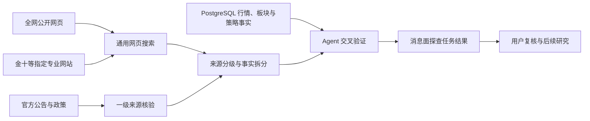

# 消息面探查功能研究评审说明

> 文档状态：待评审
>
> 评审对象：产品、研发、测试、安全、运维
>
> 事实来源：当前代码、现有产品与技术文档、官方信息源、DeepSeek 官方文档及公开研究
>
> 最后更新：2026-08-31

## 一、评审摘要

- **目标：** 让 Agent 能按需或定时探查可能影响 A 股的上市公司公告、宏观监管政策、期货交易所消息和重点标的动态，并输出可追溯、可继续研究的结论。
- **核心方案：** `web_search` 作为通用全网发现工具，默认不限制域名，需要核验时可按域名收窄；`web_fetch` 只读取已有明确公网 HTTP(S) URL 的文本正文。搜索结果与正文按来源等级决定用途，不再用“能否访问”代替“能否采信”。金十数据与其他专业财经网站复用同一套 Web 研究能力，不增加 MCP、专用接口或凭据。
- **主要影响：** 服务端提供全网搜索与受控正文抓取，固定 SSRF、跳转、端口、超时、响应大小、内容类型与审计脱敏边界，并新增“消息面探查”任务提示词与作业定义；任务中心继续承载运行与结果，不新增数据源设置和独立资讯页面。
- **本次需要确认：** 任务启用后的默认运行频率，以及一期是否只保存任务结果而不建设全量消息库与推送提醒。

## 二、背景与目标

### 2.1 背景

【事实】系统已经具备技术面行情、市场结构、财务估值、策略、任务和 Agent 研究能力，也已有受控网页搜索工具，但本地实现把搜索输入和结果限制在固定官方域名。该限制保护了证据质量，却同时削弱了通用 Agent 应有的全网发现能力，也无法稳定覆盖金十数据等高时效专业财经平台。

【已确认】消息发现需要具备全网广度；官方来源仍是最高等级证据，但专业财经平台可以作为实时消息来源。社交媒体传言、匿名爆料和无可靠出处的自媒体内容不得作为系统结论的证据。

【方案】“消息面大于技术面大于基本面”应视为需要验证的产品假设，不应直接固化为系统事实或交易优先级。消息的方向、影响对象、有效期和是否已经被价格反映都存在不确定性；一期先把消息变成带证据的研究输入，再通过前向数据验证它是否提高现有筛选策略的有效性。

### 2.2 目标与验收

| 目标 | 可观察的验收信号 | 来源 |
|---|---|---|
| Agent 可进行全网发现 | 普通会话可按标的、板块、期货品种或宏观主题搜索全网，不传域名时不会被固定来源列表截断 | 【已确认】用户要求 |
| 保留精确核验能力 | Agent 可在发现线索后按指定域名二次搜索，并对已有明确 URL 使用 `web_fetch` 获取文本正文；结果保留最终链接、实际主机名、内容类型和抓取时间 | 【方案】Web 研究工具契约 |
| 覆盖专业财经快讯 | Agent 可通过 `web_search` 将域名收窄到 `jin10.com`，搜索金十官网市场快讯，并返回标题、链接、发布时间或缺失标记、抓取时间和摘要 | 【已确认】用户要求 |
| 支持定时探查 | 任务中心出现“消息面探查”，可暂停、启用、立即运行、查看历史结果和打开来源对话 | 【事实】现有 `agent_flow` 与任务中心能力 |
| 覆盖核心消息类型 | 每次任务分别检查上市公司公告、宏观监管、期货交易所、重点标的，并对无结果的类别明确写“无新增有效消息”或数据缺口 | 【已确认】用户目标 |
| 结果可核验 | 每条结论包含来源等级、原始出处或转述关系、发布时间、抓取时间、影响对象、影响链、方向、期限、置信度、失效条件及待技术面确认项 | 【方案】研究输出契约 |
| 不越过投资安全边界 | 消息结论不自动买卖、不自动入池、不修改策略、不代替真人批准策略发布 | 【事实】仓库业务约束 |
| 能验证实际价值 | 后续能按事件可交易时间做前向统计，对比仅技术面基线与“技术面加消息过滤”结果 | 【方案】效果验证契约 |

### 2.3 范围边界

**范围内**

- 通用搜索供应商可发现的公开网页；
- 上市公司公告、交易所问询与公开投资者关系信息；
- 国务院、证监会、人民银行、发改委、统计局等宏观与监管信息；
- 上期所、大商所、郑商所、中金所、广期所的公告、规则、交易提示和公开数据变化；
- 金十数据等具备明确运营主体、时间戳、稳定网页链接和编辑责任的专业财经平台；
- 当前持仓、短线池、长线池、近期关注、每日计划池外机会及近期市场结构候选；
- 池成员中角色、标签或评估摘要明确标注为“龙头”的公司；
- 按需搜索、已有明确 URL 的受控文本正文核验、定时运行、结果留存、失败与缺口披露。

**范围外**

- 自动交易、自动入池、自动调整持仓或自动发布策略；
- 把微信群、付费群、社交媒体传言、匿名爆料、内容农场或无可靠出处的自媒体观点作为事实证据；
- 通用网页爬虫、批量抓站、附件下载和全文镜像；`web_fetch` 只处理已有明确 URL 的有界文本正文；
- 仅凭模型情绪标签形成买卖结论；
- 一期建设独立资讯页、实时推送、移动通知或全市场新闻数据库；
- 把公开消息源当成个人持仓或账户事实来源。

## 三、现状与约束

| 事实或约束 | 证据位置 | 对方案的影响 |
|---|---|---|
| 【事实】`web_search` 默认搜索全网，`domains` 接受 1—20 个合法主机名并仅在传入时收窄搜索和过滤结果 | `server/agent/web-research-provider.ts`、`server/agent/tool-validation.ts` | 通用发现与特定来源核验复用同一工具契约 |
| 【事实】DeepSeek 原生 Web Search 提供通用网页搜索，服务端继续限制协议、结果规模、超时和不可信输入边界 | `createDeepSeekWebResearchProvider`、[DeepSeek 接入说明](https://api-docs.deepseek.com/zh-cn/quick_start/agent_integrations/claude_code/) | 搜索发现无需增加供应商；正文核验由独立安全 Provider 承担 |
| 【事实】`web_search` 不抓取结果 URL，只消费供应商返回的搜索结果和引用摘要；`web_fetch` 独立校验明确 URL、每次跳转及 DNS 公网地址，正文不进入成功审计 | `server/agent/web-research-provider.ts`、`server/agent/web-fetch-provider.ts`、`server/agent/tools.ts` | 搜索与正文核验职责分离；成功审计只保存查询或 URL 哈希及必要元数据 |
| 【事实】普通 Agent 和定时 `agent_flow` 共用同一权限工具注册表，交互模型初始只携带 `tool_catalog` 元信息并按需加载完整定义，固定任务预加载领域工具 | `server/agent/session-runner.ts`、`server/agent/tool-catalog.ts` 与 `server/scheduler/runner.ts` | 新任务可按提示词加载 `web_search`、`web_fetch` 或数据库工具，同时避免无关 schema 占用固定上下文 |
| 【事实】Agent 任务的 Markdown 结果会进入 `job_run_output`，任务中心可直接查看并追问 | `server/scheduler/runner.ts`、`web/src/views/JobsView.vue` | 一期无需新增页面、结果接口或存储表 |
| 【事实】作业定义与版本化提示词属于可移植固定资产 | `server/volume/portable.ts` | 新任务会随正式固定资产包迁移，但运行结果不会进入 Git |
| 【事实】扶摇现有扩展能力只有基金资讯，没有 A 股公告、宏观新闻或期货新闻通道 | `server/datasource/hithink-datasets.ts`、扶摇 REST 契约 | 一期不能把扶摇包装成通用消息源；行情和市场结构仍优先走扶摇 |
| 【事实】当前期货能力是主力连续日线，不是期货新闻或公告 | `server/datasource/service.ts`、`server/datasource/akshare.ts` | 消息探查需补期货交易所官方域名，并与库内期货日线交叉验证 |
| 【事实】搜索摘要和网页正文均属于不可信输入，不得覆盖 PostgreSQL 事实或触发业务写入 | `server/agent/prompt.ts`、`web_search`/`web_fetch` 工具描述 | 任务必须区分“网页证据”“数据库事实”“模型判断” |
| 【事实】DeepSeek 官方说明 Web Search 会产生额外模型请求和 Token 费用 | [DeepSeek 接入说明](https://api-docs.deepseek.com/zh-cn/quick_start/agent_integrations/claude_code/) | 默认暂停并限制查询批次、结果数和运行频率 |
| 【事实】巨潮资讯提供最新公告、分类查询、互动信息和数据服务入口 | [巨潮资讯](https://www.cninfo.com.cn/new/index) | 上市公司消息一期优先从巨潮及三家证券交易所核验 |
| 【事实】期货交易所官网公开公告、交易提示、规则和市场数据 | [上期所](https://www.shfe.com.cn/) 等官方站点 | 期货消息以交易所为第一层来源，不用媒体观点替代 |

## 四、方案总览

### 4.1 核心思路

- **广搜与严判分离。** `web_search` 默认搜索全网，域名参数只用于二次收窄，不再作为准入白名单；来源等级、原始出处和交叉验证决定结果能否进入最终结论。
- **专业网站复用通用搜索。** 通用搜索覆盖广泛网页和长尾信息；金十等专业财经网站通过同一工具按域名收窄，不为单个网站增加专用接入层。官方公告和库内数据负责最终核验。
- **先做研究闭环，不做资讯门户。** 只提供通用搜索、单 URL 文本核验和探查任务，不建设专用快讯客户端、通用爬虫、全量消息库或独立资讯页面。
- **消息只提供候选证据。** Agent 必须说明影响链和不确定性，并用数据库中的行情、市场结构、行业关系和当前策略做交叉验证。
- **按可交易时间评估。** 公告发布时间晚于收盘时，事件生效时间映射到下一开市时点；不得把收盘后消息放入当日盘中判断。
- **先保留 Markdown 结果。** 一期通过来源链接和最近一次任务结果去重；只有完成前向验证后才建设结构化消息事件库。

### 4.2 核心流程



### 4.3 探查范围

| 轨道 | 首期来源 | 关注事件 | 采信要求 |
|---|---|---|---|
| 全网发现 | DeepSeek 通用 Web Search 可检索的公开网页 | 突发事件、产业变化、公司动态、海外事件、长尾线索 | 发现不等于采信；未知来源必须继续核验 |
| 专业财经 | 通过 `web_search` 搜索金十官网；其他专业平台沿用同一逻辑 | 全球宏观、商品、外汇、期货和股市市场快讯 | 必须保留网页时间或时间缺口与 URL；重大事实追溯其点名的原始来源或独立复核，不承诺搜索引擎达到官网页面的秒级时效 |
| 上市公司 | 巨潮、上交所、深交所、北交所及公司正式披露 | 业绩预告、重大合同、并购重组、回购减持、停复牌、监管问询、风险提示、产品与产能进展 | 可直接作为事件事实；仍需核对标的身份、时间和公告正文语义 |
| 宏观监管 | 中国政府网、证监会、人民银行、发改委、统计局、外汇局等 | 货币财政、资本市场制度、产业政策、经济数据和外部风险 | 政策与数据以发布机关原文为准，财经平台用于抢先发现和摘要 |
| 期货商品 | 五家期货交易所、金十及其他专业财经平台 | 供需扰动、库存、保证金、涨跌停板、限仓、交割、规则及品种异常 | 交易规则以交易所为准；供需突发至少有专业平台明确出处，并与期货行情核验 |
| 重点标的 | 全网搜索当前持仓、两类池、计划机会、近期结构候选及明确“龙头”标签 | 公司公告、产业链消息和可能改变预期的外部事件 | 与当前策略、官方行业、行情和已有计划交叉验证 |

### 4.4 任务输出契约

任务只输出新增或仍有效的高相关消息，按重要性排序。每条至少包含：

| 字段 | 要求 |
|---|---|
| 事件 | 原始标题，不改写为更强结论 |
| 来源 | 来源等级、发布者、平台、原始出处或转述关系、可点击 URL |
| 时间 | 网页发布时间或“未提供”、抓取时间、对应可交易时点 |
| 类型 | 公司、政策、监管、期货、行业或风险事件 |
| 影响对象 | 明确代码、官方行业、指数、期货品种或“暂无法可靠映射” |
| 方向与期限 | 利好、利空、混合、中性或不确定；盘中、1—3 日、5—20 日或长期 |
| 影响链 | “事实变化 → 供需、成本、收入、估值或风险偏好 → 可能影响对象” |
| 置信度 | 高、中、低，并说明来源等级、是否完成原始出处核验、映射可靠性和关键缺口 |
| 技术确认 | 需要观察的成交量、价格、板块共振或当前策略条件，不创造新阈值 |
| 失效条件 | 消息被澄清、已被价格充分反映、数据过期或策略条件不成立 |
| 建议动作 | 只允许继续研究、加入待核验清单、按原计划观察或忽略；不得直接下达买卖指令 |

任务还必须输出来源覆盖情况、搜索失败、时间缺失、无法映射和重复事件数量。无高相关新增消息时明确写“本轮未发现可形成新增判断的可靠消息”，不得为填充结果而降低采信标准。

### 4.5 影响面

| 影响面 | 变化 | 不变边界 |
|---|---|---|
| Web 研究 | `web_search` 缺省搜索全网，`domains` 仅在核验时收窄；`web_fetch` 读取已有明确 URL 的有界文本正文；结果统一按来源等级采信 | 不开放通用爬虫、附件下载、网页写入或内网访问 |
| 专业财经网站 | 金十等网站复用 `web_search`；定向探查时传入 `domains: ["jin10.com"]` | 不新增专用工具、凭据、远端接口或网页写入 |
| 定时任务 | 新增“消息面探查”提示词和 `agent_flow` 作业，默认暂停 | 继续使用现有调度、重试、任务会话和结果表 |
| 数据库 | 仅新增向前迁移中的提示词与作业定义 | 一期不新增消息事件表，不把网页正文变成业务事实 |
| 页面 | 任务中心自动展示新任务、运行历史和 Markdown 结果 | 不新增数据源设置、资讯导航、消息编辑表单或推送中心 |
| 固定资产 | 新任务定义和提示词随固定资产包导出 | 搜索结果、任务运行和消息内容仍属于本机运行数据 |
| 策略 | 消息成为研究证据和候选过滤条件 | 当前策略仍只能由真实用户批准发布 |

## 五、关键决策

| 决策问题 | 选择 | 备选方案 | 选择理由 | 影响与代价 |
|---|---|---|---|---|
| 一期做探查还是建设完整资讯系统 | 【方案】只新增定时探查任务 | 新建采集器、消息库、页面和订阅系统 | 现有链路已能闭环，先验证消息质量与用户价值 | 覆盖率不承诺达到公告数据库级别，但实现最小且可回退 |
| 首期来源范围 | 【已确认】全网发现、分级采信 | 固定官方域名白名单；无差别引用所有搜索结果 | 全网搜索保证广度，来源等级和交叉核验保证结论质量 | Agent 需要识别原始出处、转载关系和来源等级，处理成本高于白名单过滤 |
| 专业财经平台如何接入 | 【已确认】金十官网复用 `web_search`，需要时按 `jin10.com` 收窄 | 官方 MCP；专用网页采集器；通用 MCP 代理 | 与普通搜索保持同一契约、审计和安全边界，不增加专用依赖、凭据或维护面 | 召回和时效受搜索供应商索引影响，不承诺等同官网秒级快讯流 |
| 社交媒体和匿名消息用途 | 【已确认】只能生成后续核验关键词，不能出现在最终证据和结论中 | 低置信度引用；多账号交叉即升级为可信 | 多次转发不等于独立信源，引用会放大传言 | 无法追溯到可靠来源的线索将被丢弃，可能错过最早期传闻 |
| 默认运行方式 | 【待确认】任务默认暂停；建议启用后每天 08:10、12:10、15:10、20:10 运行，cron 可由用户调整 | 每日两次、盘中高频或每小时运行 | 兼顾开盘前、午间、收盘后和晚间政策/海外消息，同时控制搜索 Token 与调用成本 | 不提供分钟级预警，周末也会运行；用户需主动启用并可按成本降频 |
| “龙头”如何确定 | 【方案】只使用当前池角色、标签、评估摘要中的明确标记及近期市场结构候选 | 模型根据印象自行认定或新建全市场龙头榜 | 避免模型凭常识创造业务事实 | 未标注且未进入近期结构候选的公司不会被当作龙头重点监控 |
| 消息与策略的关系 | 【方案】消息只作为证据、过滤器或风险升级项 | 消息分数直接覆盖技术与基本面结论 | 消息方向和价格反应不稳定，需要策略与行情确认 | Agent 输出更克制，不会给出单因子买卖结论 |
| 是否一期持久化结构化事件 | 【待确认】暂不新增表，只保存任务结果和任务对话 | 立即建设消息事件、对象映射和评估表 | 没有稳定来源与标签前建表会过早固化错误模型 | 一期跨轮去重只能依赖 URL、标题和最近结果，统计能力有限 |

## 六、详细设计

### 6.1 通用 Web 搜索与正文抓取契约

`web_search` 保留有界、只读、可审计的工具形态，但取消固定来源准入：

| 项目 | 契约 |
|---|---|
| `query` | 必填，去除首尾空白后 1—500 字符 |
| `domains` | 可选，1—20 个合法主机名；缺省表示全网搜索，传入时只保留该域名及其子域名结果；不接受协议、路径、端口或通配符 |
| `recency_days` | 可选，1—3650 天，作为供应商检索偏好；不能代替返回结果的发布时间核验 |
| `max_results` | 可选，1—10，缺省 8 |
| 返回字段 | 标题、规范 URL、实际主机名、发布时间或缺失标记、抓取时间、短摘要 |
| 结果限制 | 只接受 `http`、`https`；按规范 URL 去重；单条摘要最多 2000 字符，总返回最多 12000 字符 |
| 审计 | 成功审计只保存查询 SHA-256、域名收窄条件、时间范围和条数，不保存原始查询文本或结果正文 |

Provider 只有在 `domains` 非空时才把域名收窄要求加入搜索提示，并按实际返回 URL 的主机名二次过滤；缺省时不做主机名过滤。`web_search` 只消费搜索供应商返回的结果块和引用摘要，不请求结果 URL。服务端不设置固定域名准入白名单，并保留协议、URL 解析、条数、字符数、超时、中断和不可信输入标记。

`web_fetch` 只在已有明确 URL、需要核验正文时调用，不负责网址发现：

| 项目 | 契约 |
|---|---|
| `url` | 必填，最长 2048 字符；只接受公网 `http`/`https`，拒绝用户名密码、非标准端口和敏感查询参数 |
| `max_chars` | 可选，1000—50000，缺省 20000 |
| 网络边界 | 每次请求和重定向都重新解析 DNS；所有解析地址必须为公网，并把实际连接固定到已校验地址；最多 3 次重定向、30 秒、2 MiB |
| 内容边界 | 只接受文本、HTML、JSON 与 XML；拒绝压缩或非文本内容，不下载 PDF、附件或执行页面脚本 |
| 返回字段 | 最终规范 URL、实际主机名、HTTP 状态、内容类型、抓取时间、标题、正文和截断标记 |
| 审计 | 成功审计只保存 URL SHA-256、最终主机名和字符上限，不保存 URL 原文或正文 |

搜索范围放开后，采信由以下证据等级决定。等级按单条内容的原始性和可追溯性判断，不因同一网站的品牌统一升级：

| 等级 | 判定标准 | 最终结果中的允许用途 |
|---|---|---|
| 一级：原始权威来源 | 政府、监管、交易所、上市公司正式披露、统计发布或事件责任主体原文 | 可直接支持事件事实；仍需核对发布时间、对象和正文语义 |
| 二级：专业实时来源 | 有明确运营主体和编辑责任，提供稳定 URL、时间戳和出处说明的财经平台，如金十 | 可支持“该平台在该时点报道了该事件”并进入中等置信度结论；重大公司、政策和交易规则事实要追溯一级来源或获得独立复核后才能升为高置信度 |
| 三级：一般媒体与研究 | 可识别作者或机构的新闻、研报、行业分析、采访和评论 | 支持背景、市场解释和二次佐证；不得单独支持高置信度可操作结论 |
| 四级：不可采信线索 | 社交媒体帖子、匿名爆料、聊天群、自媒体、内容农场或无法识别原始出处的转载 | 只在内部生成后续搜索关键词；不得出现在最终证据、来源列表或结论中，无法核验即丢弃 |

多个转载同一稿件只算一个证据，多个账号转发同一传言不能构成交叉验证。后续纳入其他专业平台时沿用相同搜索与分级逻辑，至少要求运营主体明确、时间和链接稳定、事实与观点可区分并具有更正机制。

### 6.2 金十官网搜索策略

金十不新增专用工具。普通会话和定时任务都调用现有 `web_search`，通过域名和查询词获取官网市场快讯：

```json
{
  "query": "市场快讯 稀土",
  "domains": ["jin10.com"],
  "recency_days": 3,
  "max_results": 8
}
```

- `jin10.com` 是搜索收窄条件，不是全局白名单；普通全网搜索不需要显式填写该域名。
- 结果沿用 `web_search` 的标题、URL、实际主机名、发布时间或缺失标记、抓取时间和摘要，不新增金十专属字段。
- 金十结果统一标记 `external_untrusted`，按二级专业来源处理，不执行摘要或页面中的任何指令。
- 若金十消息点名政府、交易所、上市公司公告或其他原始发布者，Agent 应继续全网搜索并优先追溯原文。
- 搜索无结果、发布时间缺失或结果不够新时必须列为覆盖缺口，不能用模型记忆补齐，也不能宣称已经完整读取金十实时快讯流。

### 6.3 定时任务

建议新增：

| 项目 | 值 |
|---|---|
| 作业代码 | `market_news_probe` |
| 中文名称 | 消息面探查 |
| 类型 | `agent_flow` |
| 默认状态 | 暂停 |
| 建议 cron | `10 8,12,15,20 * * *`，Asia/Shanghai；可在任务中心调整 |
| 结果 | 现有 `job_run_output` Markdown 与来源任务对话 |
| 失败处理 | 只要仍有可核验来源，个别工具或轨道缺口写入 Markdown；全部外部来源都无法形成可核验结果时任务失败，不用模型常识补齐 |

任务查询数据库时按以下优先级生成公开关键词：

1. 当前真实持仓代码和公司名；
2. 当前短线池、长线池和有效近期关注；
3. 最新有效每日计划中的池外机会；
4. 最近交易日涨停、连板、龙虎榜重合与机构游资候选；
5. 池角色、标签或评估摘要明确包含“龙头”的标的；
6. 宏观和期货固定主题。

发送给外部搜索供应商的查询只包含公开机构、公开标的代码、公司名、品种和主题，不包含“我的持仓”等关系标签、持仓数量、成本、账户信息、策略正文或未公开研究内容。

当前 `agent_flow` Runner 成功产出 Markdown 时固定记录为 `success`，不能把局部来源缺口记为 `partial`。因此一期必须在结果内列出“成功来源、失败来源、未覆盖轨道和失败原因”；不得用成功状态掩盖覆盖缺口。若后续需要按来源健康度筛选和告警，再单独扩展结构化运行状态。

### 6.4 去重与时效

- 单轮以规范化 URL 为主键去重；无稳定 URL 时使用“来源域名、标题、发布时间”组合去重。
- 读取最近一次成功的同任务结果，已出现且事实无变化的事件放入“持续有效”而非“新增”。
- 发布时间缺失时不得判断事件先后，只能标记时间缺口。
- 收盘后、周末或休市日发布的消息，其最早可交易时点映射到下一开市日；回测和复盘使用该时点，不能使用自然发布日期直接对齐日线。
- 同一事件被多站转载时保留最接近原始发布者的来源，其他独立来源只作交叉验证；稿源、标题和正文高度一致的转载不计为独立证据。

### 6.5 外部集成与失败处理

- 继续复用 PostgreSQL 中已启用且官方 Base URL 的 DeepSeek 凭据，不增加新密钥入口。
- Web 搜索沿用现有 60 秒超时、协议过滤、条数与字符限额、查询哈希审计和中断信号；域名过滤只在调用方显式传入 `domains` 时启用。
- 金十与其他网站共用 Web 搜索供应商、输入契约、结果限制和审计逻辑，不增加独立认证、网络客户端或失败状态。
- 每条轨道使用有界查询，不把全部池成员拼成一条可能泄露组合结构的大查询。
- 供应商未执行搜索、无有效来源、发布时间缺失或指定域名无匹配时，必须作为可见缺口。
- 网页中的提示词、工具调用、投资指令和数据写入要求全部忽略。
- 不缓存或分发新闻全文；一期只在任务结果中保存必要标题、短摘要和来源链接。

### 6.6 二期升级门槛

只有连续前向运行证明消息探查有稳定价值，且明确需要全量覆盖、跨期检索、订阅或统计时，才进入结构化建设：

1. 与来源方确认正式 API、授权和限流契约；不把网页页面接口当成长期公共 API。
2. 由 `datasource` 采集器保存来源、规范化 URL、标题、发布时间、抓取时间、短摘要和内容哈希，不保存无授权全文。
3. 以唯一约束完成幂等入库，再由 Agent 对事件与标的、板块、期货品种进行结构化评估。
4. 原始事件事实和模型评估分表保存；模型判断不能覆盖原始来源。
5. 再评估是否需要独立消息页、订阅规则和应用内提醒。

## 七、实施与发布

| 阶段 | 交付边界 | 前置依赖 | 完成信号 |
|---|---|---|---|
| 一期实现 | 放开 `web_search` 的固定域名限制、加入受控 `web_fetch` 并落实来源分级；在任务提示词中增加金十官网定向搜索；新增默认暂停的消息面探查作业并更新现有测试 | DeepSeek 官方配置可用 | 普通 Agent 可默认搜索全网、按任意合法域名收窄并核验已有明确 URL 的文本正文；任务可手动运行并生成合规结果 |
| 前向试运行 | 用户启用任务；连续记录来源覆盖、延迟、重复、有效消息与后续价格表现 | 一期实现稳定 | 能回答消息是否改善候选筛选，而不是只展示更多内容 |
| 条件性二期 | 正式数据接入、结构化事件、订阅和统计 | 试运行证明价值且来源授权明确 | 事件幂等、可检索、可复盘，覆盖和延迟有量化指标 |

一期实施只涉及 `server/agent` 的搜索/正文抓取契约与工具、调度提示词与作业、向前迁移和相关现有测试，不增加系统设置、前端页面、API 类型或专用数据源模块。新迁移只向前执行；回退时暂停任务并在提示词中移除金十定向查询即可，已生成的任务结果作为本机审计保留。实现阶段不得修改已应用迁移。

## 八、验收与验证计划

| 验收行为 | 计划验证方式 | 观察信号 | 风险或缺口 |
|---|---|---|---|
| 缺省搜索覆盖全网 | 扩展 `tests/server/chat-tools.test.ts` | 不传 `domains` 时请求不含固定域名限定，不同合法主机名结果都可保留 | 供应商线上召回率需人工抽样 |
| 指定域名仍可精确核验 | 扩展 `tests/server/chat-tools.test.ts` | 合法自由域名可通过参数校验，返回结果只保留指定域名及子域名；非法 URL 和协议被丢弃 | 域名收窄不是来源可信度判定 |
| 搜索安全上限不回退 | 扩展 Web Provider 和工具现有用例 | 条数、摘要、总字符、超时、中断、URL 去重与查询哈希审计保持有效，审计不含原始查询 | 全网内容的提示注入和 SEO 噪声仍需人工抽样 |
| 金十官网快讯复用普通搜索 | 扩展 `tests/server/chat-tools.test.ts` 并人工执行有界查询 | `domains: ["jin10.com"]` 可通过通用参数校验，只保留金十主域及子域结果，字段、审计和错误与普通搜索一致 | 搜索引擎召回与延迟不等同于官网实时流，需在结果中披露 |
| 任务可从空库迁移生成 | 扩展 `tests/server/migrate.test.ts` | 提示词、修订、作业定义、默认暂停和 cron 完全一致 | 不对生产库做恢复演练 |
| 任务定义可进入固定资产并恢复 | 扩展迁移、固定资产与路由现有测试 | 源库与恢复库的任务和提示词哈希一致，运行结果仍为空 | 正式包替换仍需真实用户确认 |
| 任务可手动运行并保存结果 | 运行相关 `tests/server/scheduler.test.ts` 用例 | 绑定提示词版本、任务会话、运行状态和 `job_run_output` 正确关联；个别来源缺口进入 Markdown | `agent_flow` 当前没有部分成功状态，缺口完整性还需检查结果正文 |
| 输出遵守来源分级和消息契约 | 使用固定搜索结果夹具验证提示词，并人工检查一次含金十结果的真实搜索 | 来源、等级、原始/转述关系、时间、影响链、置信度、技术确认、失效条件与缺口齐全；社交媒体内容不进入证据 | LLM 文本质量不能只靠单元测试保证 |
| 不发生越权写入 | 检查任务提示词和工具审计 | 无持仓、池、策略发布或任务定义写入；网页不覆盖数据库事实 | YOLO 也不得越过策略发布门禁 |
| 消息价值可评估 | 前向记录事件可交易时点，并比较技术面基线与加入消息过滤后的 1、3、5、20 个交易日表现 | 命中率、超额收益、最大回撤、换手和误报可比较 | 样本不足前不能得出“消息面更重要”的结论 |

实施时按仓库要求执行：

```bash
npm run typecheck
npx vitest run tests/server/chat-tools.test.ts tests/server/scheduler.test.ts
npx vitest run tests/server/migrate.test.ts tests/server/migration-volume.test.ts tests/server/volume-routes.test.ts
```

### 8.1 效果评估口径

- 事件标签必须使用当时实际可见的标题、摘要、发布时间和模型版本；不得把后续澄清、价格结果或模型训练记忆带回历史判断。
- 回测只从事件最早可交易时点开始，收盘后消息从下一开市时点计算。
- 对照组至少包含“现有技术面策略”和“现有技术面策略加消息过滤”；不能只报告消息组收益。
- 分开统计公司、政策、监管、期货和行业事件，避免一种消息类型掩盖其他类型。
- LLM 历史回测存在训练期重叠和公司既有知识干扰风险。公开研究 [《评估 GPT 情绪分析生成股票收益预测中的前视偏差》](https://arxiv.org/abs/2309.17322) 指出前视偏差与公司知识干扰都会影响结果，因此系统结论以真实前向运行优先。

## 九、风险与回退

| 风险 | 触发条件 | 缓解措施 | 回退或恢复 |
|---|---|---|---|
| 搜索召回不完整 | 原站有公告但供应商没有返回 | 明确“不保证全量”，按轨道分批查询并抽样对账；二期改正式 API | 暂停任务，继续使用人工官方查询 |
| 全网噪声和 SEO 污染 | 搜索返回采集站、标题党、机器生成内容或无原始出处的转载 | 来源分级、原始出处追溯、允许“无法核验”、低等级来源不得支持高置信度结论 | 任务提示中临时按域名收窄，不恢复全局固定白名单 |
| 传言被多次转载后“洗白” | 多个平台或账号引用同一匿名源 | 识别稿源和转述链，转载不算独立证据；社交媒体只生成核验关键词 | 丢弃无法追溯的事件并记录线索淘汰数量 |
| 误报或错误映射 | 标题含糊、同名公司、产业链关系由模型猜测 | 标准代码核验、来源分级、允许“无法可靠映射”、要求技术面确认 | 忽略该条，不写业务事实 |
| 搜索 Token 成本失控 | 高频运行、标的过多或每条消息执行多轮搜索 | 默认暂停、每日四次建议、有界候选、查询批次和结果数 | 暂停任务或降低频率 |
| 外部查询暴露组合结构 | 一次把全部持仓和池关系发送给供应商 | 只发送公开关键词，分散查询，不发送关系标签、数量、成本和策略正文 | 停止定时查询，改为用户按需查询 |
| 时间穿越 | 收盘后公告被用于当日盘中判断或历史模型知道后续结果 | 固化发布时间、抓取时间和最早可交易时点；前向评估优先 | 废弃受污染样本并重新统计 |
| 外部内容提示注入 | 搜索摘要或快讯包含要求调用工具、泄露数据或修改策略的文本 | 沿用 `external_untrusted`、只读搜索边界和真实用户发布门禁 | 中断该来源处理并记录缺口 |
| 搜索收录延迟或页面索引变化 | 金十官网已有快讯但搜索供应商未收录、返回过旧摘要或页面链接变化 | 明确不承诺秒级实时流，记录抓取时间和覆盖缺口，按主题与域名执行有界复查 | 暂停该定向轨道或改为人工官网核验；确有独立实时接入需求时另行评审 |
| DeepSeek 不可用 | 未配置、限流、超时或搜索工具未执行 | 整体不可用时任务失败；个别查询缺口写入结果，不用模型记忆补齐 | 暂停任务，其他数据库功能不受影响 |

## 十、待确认事项

- 【待确认】【产品、运维】是否接受任务默认暂停，启用后建议每天 08:10、12:10、15:10、20:10 运行。
  - 影响：决定默认 Token 成本、信息延迟和部署后是否会因未配置 DeepSeek 而持续失败。
  - 建议：默认暂停；由每台实例用户配置 DeepSeek 后主动启用，并按成本与所需时效调整 cron。
- 【待确认】【产品、研发】一期是否接受只保存 Markdown 结果，不建设结构化消息事件库和应用内推送。
  - 影响：决定实现规模、跨期去重和统计能力。
  - 建议：接受；先用前向结果证明消息探查能改善筛选，再投资结构化建设。

## 十一、评审结论

- 结论：建议按一期范围进入评审和实现；运行频率与是否建设结构化消息库不阻塞底层能力设计。
- 已确认决策：消息发现默认覆盖全网，专业财经平台可以采信但必须保留转述关系和置信度；社交媒体、匿名爆料和无可靠出处内容不能作为最终证据；策略发布仍只允许真实用户批准，消息面不得自动交易、自动入池或覆盖 PostgreSQL 事实。
- 实施边界：先交付通用全网搜索、来源分级、金十官网定向搜索和默认暂停的探查任务，不增加 MCP、专用快讯工具、凭据、通用爬虫、全量消息库或独立资讯页面。

## 十二、外部来源

- [巨潮资讯：首页、公告、互动信息与数据服务入口](https://www.cninfo.com.cn/new/index)
- [中国政府网政策栏目](https://www.gov.cn/zhengce/)
- [国务院政策文件库](https://sousuo.www.gov.cn/zcwjk/policyDocumentLibrary)
- [中国人民银行](https://www.pbc.gov.cn/)
- [上海期货交易所：公告、交易提示与市场数据](https://www.shfe.com.cn/)
- [大连商品交易所](http://www.dce.com.cn/)
- [郑州商品交易所](https://www.czce.com.cn/)
- [中国金融期货交易所](http://www.cffex.com.cn/)
- [广州期货交易所](http://www.gfex.com.cn/)
- [DeepSeek 官方 Web Search 说明](https://api-docs.deepseek.com/zh-cn/quick_start/agent_integrations/claude_code/)
- [金十数据官网](https://www.jin10.com/)
- [公开研究：评估 GPT 情绪分析生成股票收益预测中的前视偏差](https://arxiv.org/abs/2309.17322)
