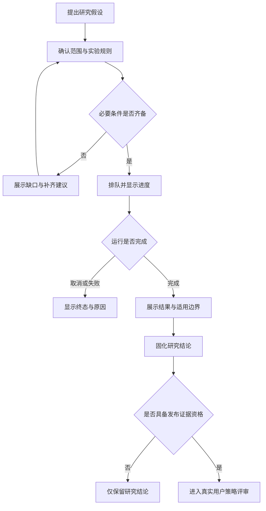
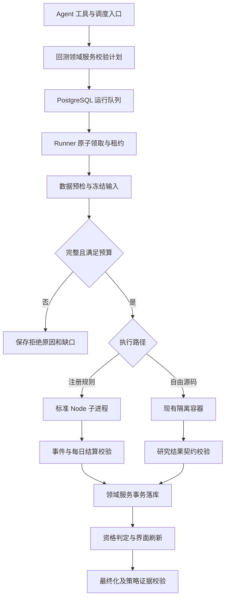

# 系统回测能力架构规划技术评审

> 文档状态：方向已批准；标准日频研究运行闭环已实现。本文同时列出后续能力规划，未实现的历史制度、公司行为及全市场容量不得视为已验收。
> 评审对象：产品、研发、测试与部署维护者。
> 更新日期：2026-09-11。
> 事实来源：当前仓库源码、[优化预案](系统策略优化方案预案.md)、[数据与回测前置缺口分析](design/系统策略优化方案预案_数据缺口分析.md)、[独立部署说明](独立部署说明.md)。
> 文档分工：缺口分析定义需要哪些数据和证据；本文定义这些输入如何进入系统、如何执行、如何验收及交付。新增模块、字段和配置均为拟议设计，不是现有接口。

## 一、评审摘要

- **目标：** 从“Agent 编写代码并返回收益”的研究工作器，建设为“系统控制历史时点、执行、账本和证据”的日频回测能力，支持策略优化的同口径比较。
- **核心方案：** 保留 Agent 作为实验规划与解释入口；标准化回测使用仓库维护的确定性规则和统一组合引擎；自由源码继续在现有独立容器内探索，但其结果不自动成为正式收益证据。两条路径共用运行台账、比较关系和结论展示，不建设第二套数据平台。
- **主要影响：** 回测领域服务、数据准备、纯函数规则、工作器、Agent 工具、策略发布证据校验、回测页面、迁移与私有备份。
- **第一交付边界：** A 股多头、单现金账户、人民币、无杠杆、收盘生成信号并在后续开盘模拟成交。先做右侧基线及环境/止损/熔断变体，再接其他策略。不含实盘自动下单。
- **架构决定：** PostgreSQL 是唯一事实源；标准化回测不依赖 Docker Socket；无 Redis、外部 Python Runner、任意表达式执行或新增微服务。策略域仍只保存当前正文，不恢复历史策略版本管理。
- **评审事项：** 接受第一期范围及有标识的日频执行近似；批准实施阶段划分。研究参数可以在实验中冻结，不构成生产发布授权；涉及真实策略发布、恢复和破坏性清理仍走既有用户确认。

## 二、需求与业务变化

### 2.1 需求目的

用户需要判断震荡过滤、减少同类信号、调整止损和回撤熔断是否改善策略，而不是仅得到一条无法追溯成交的收益曲线。每个结果必须能回答：当时能看到什么、为什么选或不选、以什么条件成交、费用多少、现金和仓位如何变化、结论在哪些范围成立。

### 2.2 范围边界

**范围内**

- 可复现输入、历史可用时点、逐日信号、模拟成交、组合账本、风险状态与统一统计。
- 固定样本研究和历史时点研究分别标识；多策略按阶段接入。
- 异步运行、进度、取消、故障恢复、结果固化与比较资格。
- 数据缺失清单与受控回填建议；采集和回测分开运行。

**范围外**

- 自动下单、融资融券、卖空、期货保证金和 ETF 特殊规则；后续按品种独立设计，不套用股票模型。
- 第一期不提供逐笔、盘口排队或竞价撮合；不承诺涨停板买得到。
- 不重放没有历史记录的 LLM 自由判断，不把公开行情反推为真实个人持仓。
- 不自动覆盖生产策略、导入外部策略包或将回测运行材料放入 Git 固定资产。

### 2.3 业务逻辑与流程

1. 用户或 Agent 提出假设，选择基线、变量、样本与验证范围。
2. 系统检查数据和执行规则；缺少必要条件时给出具体缺口，不静默改样本、缩区间或修改假设。
3. 条件满足后排队运行，用户可看进度或取消，不需要等待聊天一直占用。
4. 系统展示收益、风险、交易与拒单原因，以及研究近似和证据等级。
5. Agent 可以固化研究结论；只有满足资格的标准化结果才作为策略发布的回测证据。策略正文发布仍须真实用户确认。



## 三、现状与约束

| 事实或约束 | 证据位置 | 设计影响 |
|---|---|---|
| 当前工作器输入为日线和部分市场事件，接受策略自行返回的收益 | `server/backtest/agent-contract.ts`、`worker-runner.mjs` | 不能将原结果契约继续当作权威组合收益入口 |
| SDK 可读全区间，数据查询无起点前预热 | `server/backtest/agent-workspace.ts`、`worker-runner.mjs` | 新引擎按时点供给，研究旧结果不推定无前视 |
| 已有源码保留、输入/源码哈希、比较和最终化 | `server/modules/backtests/repo.ts` | 保留台账并扩展；哈希之外需要可读取的冻结输入 |
| 当前源码策略运行依赖宿主执行 Docker；镜像未安装 Docker 客户端 | `server/backtest/agent-workspace.ts`、`Dockerfile` | 标准化路径独立于嵌套容器；自由代码不能回退到应用进程 |
| Compose 与应用代码默认开启工作器，容器镜像未装 Docker CLI 也无 Socket | `docker-compose.yml`、`server/backtest/agent-workspace.ts`、`Dockerfile` | 保持开关开启；容器内不具备执行条件时明确失败，不用高权限挂载掩盖 |
| 右侧等已有确定性评估函数，但服务入口读取当前池和实盘持仓 | `server/modules/plans/daily-context.ts`、`strategy-screen.ts`、`swing-signals.ts` | 复用或提取计算内核，不能对历史日期直接调用整套生产查询 |
| 综合指数滚动 21 日从 100 重置 | `server/analysis/service.ts` | 计算跨日斜率须使用共同基准序列，并验证三态输出兼容 |
| 当前策略发布关联仅检查完成状态与最终化 | `server/modules/strategy/repo.ts` | 增加证据资格和计划关联校验，禁止任意收益晋升 |
| 仅当前策略正文可移植，回测是本机运行数据 | `AGENTS.md`、`server/volume/portable.ts` | 保存运行执行计划不是恢复策略版本库；所有新回测表排除固定资产 |
| 当前日线/事件各 50 万行、输入 128 MiB、内存 1 GiB、超时 60 秒 | `server/backtest/agent-contract.ts` | 新标准化路径按日分块；保留研究沙箱原限制，不简单扩大所有上限 |

## 四、技术方案

### 4.1 两条执行路径和权威边界

| 路径 | 接受什么 | 谁计算成交与收益 | 部署与资格 |
|---|---|---|---|
| 标准化回测 | 已注册规则标识、类型化参数、输入集、成本与执行方案 | 仓库维护的信号函数和组合引擎 | 应用内受控 Node 子进程；不需要 Docker；仍须通过质量门槛 |
| 自由源码研究 | 现有 TypeScript 源码与 SDK 输入 | Agent 源码自行研究，系统验证输出格式 | 保留独立无网络容器；不可直接取得正式收益证据资格 |

**标准化回测绝不接收可执行源码、脚本路径、任意表达式、动态模块地址或 Agent 自报收益。** 规则注册表是静态导入和严格参数校验，不建设通用策略语言、插件市场或运行期代码热加载。

Agent 可以选择已注册规则、设置参数、安排消融实验、读取明细和解释结果。**这是已确认的能力边界，不是待补功能**：内置 Agent 环境不自由，自主空间就是“选规则 + 调参 + 消融 + 解读”；新增规则必须走仓库代码变更。新的自由源码想进入标准化路径，必须先形成仓库代码变更，通过公式一致性、时点、账本和边界测试，再作为新规则实现随应用发布；修改源码本身不发布生产策略。

标准化路径采用子进程是为隔离 CPU、内存、取消和崩溃，**不是为任意代码提供安全沙箱**。仅受信任引擎可进入此进程；不得用 Node 进程、线程或语言虚拟机替代自由代码的容器隔离。

### 4.2 模块职责与最小落点

以下新增路径是实施落点，按阶段创建，不预先搭空目录。

| 模块 | 复用/新增位置 | 职责 | 禁止事项 |
|---|---|---|---|
| 回测领域编排 | 新增 `server/modules/backtests/service.ts`，复用 `repo.ts` | 参数校验、预检、创建、取消、最终化资格、事务写入 | Agent 通用 SQL 写入 |
| 契约 | 新增 `server/backtest/contracts.ts`，旧 `agent-contract.ts` 保留研究兼容 | 标准请求、计划、输入、事件和报告结构 | 复用含源码的旧契约作为新正式请求 |
| 数据准备 | 新增 `server/backtest/input.ts` | 从 PostgreSQL 读取、预检、按一致快照冻结、按日提供数据 | 运行时调用供应商或静默补数 |
| 规则适配 | 新增 `server/backtest/rules.ts`；复用 `server/indicators/` 与计划纯函数 | 规则注册、依赖声明、确定性信号和退出意图 | 读取当前池、真实仓位、系统时钟或环境凭据 |
| 模拟内核 | 新增 `server/backtest/engine.ts` | 事件时序、撮合、现金持仓、风控和统计 | 接受策略自行写现金、仓位或收益 |
| 标准工作器 | 新增 `server/backtest/engine-worker.ts` | 消费固定计划和日批次，返回有序事件和结算 | 数据库、网络与领域写操作 |
| 运行调度 | 新增 `server/backtest/runner.ts`，复用调度器的原子领取模式 | 领取、租约、心跳、子进程、取消、批次持久化 | 把每个实验变成一个定时任务定义 |
| 自由代码工作器 | 现有 `agent-workspace.ts`、`worker-runner.mjs` | 继续服务探索模式和旧源码 | 不具备 Docker 时在应用内执行源码 |
| Agent 与页面 | `server/agent/`、`web/src/views/BacktestsView.vue` | 发起、状态、解释、证据展示和比较 | 隐藏近似、取消或质量失败 |

首期将撮合、账本和风控放在一个内核模块中，靠明确函数职责组织；只有代码规模和独立调用需要时再拆文件，不建设接口只有一个实现的抽象层。

### 4.3 技术实现主链路



### 4.4 标准运行请求与冻结执行计划

下列字段为新标准请求契约，具体 TypeScript 类型依此实现；所有金额、价格与百分比单位均在 Schema 固定。

| 字段组 | 必填内容 | 校验 |
|---|---|---|
| 研究身份 | 名称、假设、来源会话、幂等键、基线运行、单一变量说明 | 同会话幂等键唯一；相同键不同规范化请求拒绝 |
| 数据范围 | 预检输入集或股票池定义、正式起止日期、基准 | 日期真实、交易日历存在；不允许代码范围自动变成每日资格 |
| 规则计划 | 静态规则标识、实现版本、参数、信号/退出/排名/资金分配/风控配置 | 未注册规则、未定义必填参数和未知字段拒绝 |
| 模拟账户 | 初始现金、每策略预算、组合与单标的上限 | 首版不导入真实仓位，不允许杠杆与现金注入 |
| 执行方案 | 成交时点、订单有效期、价格/复权、交易制度、费用与滑点配置 | 目标区间每一天都有有效规则；无默认零成本 |
| 样本划分 | 训练、参数选择、样本外区间及收益标签观察期限 | 不重叠；跨边界未完成标签剔除，不能把整段均称样本外 |
| 研究近似 | 当前成分、固定池、历史财务近似、日频执行近似的明确声明 | 近似必须由系统依据输入与规则生成，不能靠 Agent 自报清空 |

领域服务将其规范化成不可变运行计划，补齐规则依赖、预热起点、排序规则、金额精度、引擎构建哈希、输入集哈希、费用版本和当前策略哈希。计划哈希采用固定字段集合、排序对象键、规范日期/金额字符串的规范化序列化；排除运行编号、创建时刻等非语义字段，拒绝非有限数和重复键。运行不保存当前策略正文副本；保留有限、可执行的规则参数与规则实现标识作为本次实验材料，不提供历史策略正文读取或恢复能力。

执行计划的代码只来自应用制品。精确重放要求匹配制品仍可获得；哈希一致但制品不可获得时显示“材料部分可用”，禁止用当前实现冒充旧实现。应用制品和私有运行材料不进入固定资产包。

### 4.5 规则和生产共用方式

- 从 `daily-context.ts` 提取必要的纯计算函数到无数据库依赖的规则文件；生产入口和回测适配器都调用它们。提取时不改变原条件，使用现有测试守住输出。
- 右侧六条件原样复用；环境过滤、排序、同类限仓、仓位与熔断在组合层处理，不能混入六条件函数。
- 复用 `calculateIndicators`、股性计算及波段评估的公式，不直接复用读取当前数据的服务函数。回测画像以当日可见历史计算，缓存须含截止日期、输入哈希和公式版本。
- 881 综合指数从统一锚点连续合成；对同一集合、同一截止日，MA5/MA20 大小关系、ROC5 和温度应与现有口径一致。跨日 MA20 斜率在连续序列内计算。
- 注册规则声明必需字段、可用时刻、最短窗口、递归指标初始化和依赖参数；不能只参考 `STRATEGY_SCREEN_MIN_BARS` 的最短根数就认为完整预热。
- 递归指标默认从冻结输入的共同种子起点计算；基线与变体使用同一种子。若只取有限历史，须记录初始化方法及收敛检查，不用今天的指标值回填过去。
- **预热深度必须与生产一致**：生产日线指标读取“截至最新行情日的近六年”窗口，并从窗口第一根开始递归计算 EMA/MACD（`server/indicators/service.ts`；公式对齐 `ewm(adjust=false)`）。因此右侧六条件涉及的递归指标，冻结输入的预热深度也取六年并从共同种子起点计算，预热区间不计入信号日；不能用更短的三年窗口冷启动后声称与生产同值。若确因容量只取更短窗口，必须做收敛检查并给出数值容差，单独披露而非默认一致。
- 数据完整不代表策略文字完整。退出、仓位、排名尚无确定性定义时，标准请求校验拒绝或仅登记明确命名的实验规则，不能声称已经复现整套生产策略。

### 4.6 数据准备、冻结与历史可用时点

**数据准备分为预检与冻结，预检结果不是执行快照。**

1. 预检输出每个数据域的覆盖、缺口、预热、字段单位、近似、预计行数、磁盘与内存预算；给出服务层可执行的回填建议。预检不自动访问供应商或修改研究范围。
2. 冻结使用单个受限时长的一致读事务，按稳定主键分页读取同一数据库快照；同时写入本次输入集分块。事务提交前输入集不可执行；冻结期间由独立控制连接维持心跳和检测取消，绑定输入集前再次校验运行代次与取消状态，失效则不进入执行；取消或失败回滚，不拼接多个无共同快照的批次。
3. 输入分块按交易日期/数据域/序号组织，使用标准库压缩保存 PostgreSQL 二进制载荷；单块限制未压缩大小和解压后行数。工作器按日流式接收，不将全市场多年数据一次序列化。
4. 输入集保存规范化清单、行数、各块哈希、总哈希和质量报告。已有同内容输入集可共用；只按内容哈希复用，不按“相同请求日期”复用可变数据。
5. 每条外部记录区分经济归属日期、公开可用时刻和采集时刻；历史回填不因今天才采集而全部不可用，但不能用今天的快照伪造过去可用内容。公告仅有日期时按下一交易日开放；无法证明历史内容时标近似。
6. 策略上下文仅含截止当前决策时点的数据。撮合器可以消费当天开盘，但开盘成交之前的策略不能读取当天收盘/成交量。收盘事件和全日涨跌停汇总仅在收盘阶段开放。
7. 信号价格从原价及截至决策时点已生效的公司行为生成一致的调整序列；当前前复权历史仅在确认对应条件对基准缩放不敏感且与时点输入等价时复用，否则只作近似研究。对比生产必须注明价格口径，不能为一致性强行使用未来复权事件。
8. 外部数据更新不得改变已冻结输入；修正数据产生新输入集，旧结果保持原证据及修正提示。
9. 首版完整模式遇必需行情缺失直接拒绝。固定池降级、缩窗或删除特征必须创建新实验、显式改范围，不能在运行中静默进行。

输入白名单只包括市场数据、必要的行业/池资格、规则参数、评分基准与模拟账户配置，不包括 API Key、真实持仓、聊天或完整策略正文。所有临时流和日志限制大小，错误只返回阶段、缺口与安全标识。

### 4.7 日频事件时序与订单语义

第一期注册“收盘决策—后续开盘执行”方案，时间基准固定为交易所日历和北京时间。它是可验证的日频模型；若原策略依赖盘中突破，则必须标为日频近似而非完整原策略回放。

| 阶段 | 输入与处理 | 输出与不变量 |
|---|---|---|
| 交易日前 | 生效公司行为、历史交易状态、可卖数量、上日挂起的退出意图 | 更新现金/股份及可卖状态；不能读取当日收盘 |
| 开盘 | 上一决策日已存在的订单与当日开盘可交易信息 | 先卖后买；按计划冻结的顺序执行；成交后才释放和使用现金 |
| 盘中 | 首期不运行新盘中信号 | 不根据当日高低价推断唯一触发顺序；不承诺触价即成交 |
| 收盘估值 | 当日收盘或确认停牌的最近有效价；已知公司行为 | 每日持仓、现金、权益、费用；停牌估值明确标记，采集缺失不得伪装停牌 |
| 收盘风控 | 本次模拟权益、退出闭环与环境 | 更新熔断和次日开仓资格；触发优先于恢复 |
| 收盘信号 | 截止收盘可见特征与模拟持仓 | 先生成全候选与退出意图，再统一去重、排名和分配预算，产生后续订单 |

具体执行约定：

- 初始现金默认 100 万元，可覆盖；初始持仓为空。资金和成本用有界定点整数或十进制字符串传输，金额以分结算；价格使用足够精度的整数单位，手续费每笔四舍五入至分，持仓市值逐标的舍入至分后相加，避免浮点账本漂移。
- 买单仅下一交易日开盘有效，未成交部分当日过期；卖出风险意图在仍有可卖持仓时次日重建，直到退出或规则明确解除。记录过期、拒绝、部分成交与重建原因。
- 同一时刻：先风险退出，再其他卖单，再买单；组内按冻结的优先级、信号排名、标的代码、订单序号排序。不得依赖数据库返回顺序。
- 实际成交数量按当日适用的最小申报单位向下取整，费用后现金不得为负；超过可卖数量拒绝或按明确规则部分执行，所有动作留痕。
- 主板、创业板、科创板及历史制度不同的标的按生效日期配置，未覆盖的制度拒绝运行。具体交易制度和历史费率须由实施阶段从官方来源核验后录入版本化配置，不在本文编造费率。
- 不能用当日最终成交量决定早盘买入资格。首版容量约束使用截至前一日的 20 日平均成交量，参与率必须在执行配置中填写；该约束是容量假设，不证明开盘真实深度。
- 滑点使用不利方向的基点模型，买价上调、卖价下调；参数必须显式填入并做敏感性比较。价格超出已知当日价格限制不截断伪成交，而是记录未成交。
- 首版保守模型中开盘处于涨停价的买单、开盘处于跌停价的卖单视为未成交；不能据此声称盘中也无法成交。无价格限制品种若不在首期支持表中则拒绝。
- 关闭盘中止损；收盘触发的止损在后续开盘成交，跳空按实际模拟开盘价格处理。升级盘中模型之前不把该结果命名为盘中止损回测。
- 公司行为用成交原价账本处理，分红在适用发放日入现金，应收权益在明确规则下估值；送转更新数量和成本。缺必要事件时不得靠前复权曲线代替真实现金收益。配股等需选择权的事件首期若未实现则在预检拒绝受影响范围。
- 测试终点默认按持仓市值计权益，不强制虚构平仓。未闭环交易单独统计；如选择终点清算，须标为另一执行方案，不用于偷补闭环样本。

### 4.8 模拟账本、策略归属与组合风控

统一维护现金、每标的股份、可卖数量、批次成本、策略归属、订单和已实现盈亏。每次买入生成可追溯批次；同标的多策略首先按确定性优先级决定归属，首版不允许一笔成交拆成多个主策略。卖出按同标的先进先出分摊批次、买入费用和退出原因。

账本每天满足：

- 期末现金 = 期初现金 + 卖出净收入 − 买入支出及费用 + 当日现金权益变动。
- 组合权益 = 现金 + 持仓市值 + 已确认应收权益；第一期无外部出入金。
- 日收益 = 当日权益 / 前一结算权益 − 1；首日以前期权益为初始现金。
- 收益率、最大回撤和交易统计由内核计算，领域服务从持久化事件复核；Agent 文本不能覆盖权威指标。

**实验默认规则，不是生产发布：**

| 项目 | 第一轮确定性选择 |
|---|---|
| 回撤熔断 | 收盘权益相对包含当日在内最近 20 个交易日高点回撤严格大于 5%；不足 20 日使用已有结算序列 |
| 连续止损 | 全组合按已完全关闭的入场批次计数；批次最后一次退出原因为策略止损才累计，普通亏损不算；混合退出原因完整留痕，非止损闭环重置计数；部分退出不计新一笔 |
| 同日闭环排序 | 成交时间、卖单序号、批次序号固定排序，逐批更新，不用结果金额重新排序 |
| 暂停范围 | 暂停所有策略新开仓和增加敞口；允许退出，不强制卖掉所有存量 |
| 恢复 | 收盘连续综合指数 MA20 不下降（MA20 斜率≥0，用户定义）且当日无新触发，并至少完整暂停一个交易日，次日恢复；恢复时重置连止损计数，滚动高点不重置 |
| 多规则冲突 | 任一风险触发优先于恢复；现金和交易制度优先于所有策略信号 |
| 同类限仓 | 首轮将同一入场策略视为同类，参数分别试 1、2 个当日新开仓；行业约束是独立实验，不混为同一个“同类” |
| 排名 | 使用已注册的生产确定性排名；若无排名，首轮使用信号强度中已核验的成交量/5日均量降序、代码升序的显式实验排名，不称为生产原排名 |
| 同标的多信号 | 沿用生产可验证的右侧、左侧、试盘优先级；波段和打板未接入时不隐式参与竞争 |
| 波段乘数 | 0.8 仅乘新开仓预算，不隐含存量再平衡 |

连止损触发采用“本次新增止损闭环后计数至少三笔”的事件条件，暂停期间没有新闭环时不能仅因旧计数仍为三重复触发；回撤条件则每日重新评估。恢复日计数重置；若回撤仍严格大于 5%，当日仍触发回撤规则，不恢复。**恢复条件中“最短暂停一个完整交易日”与“当日无新触发”是在用户给定的“MA20 斜率非负”之上增加的设计，需与用户定义一并确认。**

**标准运行的 `kind` 归属**：标准回测默认记为 `kind='research'`；只有取得合格资格并显式成为正式锚点时，才占用 `formal + status='active'`（`backtest_run_single_active_formal` 全局唯一索引语义不变）。旧记录的分类字段不因新增引擎类型而改变。

这些规则在计划中可见、可固定，生产发布前必须由用户审核。实验可改参数，但每次改动生成新计划，不修改旧运行。ADX、宽度和新的震荡复合条件必须单独登记对象、阈值与组合方式，未填写时关闭并标“本次未验证”，不能默认实现了整份预案。

### 4.9 结果与资格

运行成功、数据质量、研究适用性和结论最终化相互独立。

| 维度 | 设计值 | 规则 |
|---|---|---|
| 执行状态 | `queued / preparing / running / success / failed / cancelled / rejected` | 仅描述任务是否执行和结束；中间结果不当成功 |
| 质量状态 | `unchecked / complete / incomplete / invalid` | 由预检与校验器写入，Agent 无权提升 |
| 证据资格 | `research_only / qualified / legacy_unverified` | 旧结果默认未按新规范验证；标准引擎不自动等于合格 |
| 重放能力 | `exact / materials_only / unavailable` | 同时检查数据、计划、费用与代码制品是否可得 |
| 最终化 | 复用 `working / final / superseded` | 表示研究结论是否固化，不等于策略批准 |

取得合格资格须同时满足：标准引擎、完整有效数据、无未声明的时点泄漏、账本一致、执行约定完整、输入及计划可复核、所声称结论与支持范围一致。当前行业/股票池快照回看、多年财务时点不明或任意收益源码均只能保留研究结论；合格的日频模型也只能证明其声明的日频规则，不能扩展为盘中执行证据。

兼容迁移保留历史 `partial` 执行值；只有新标准运行使用上表状态机，不能把旧 `partial` 批量改成 `success`。新字段对旧行默认质量未检查、资格 `legacy_unverified`、重放能力按实际材料判定。旧 `kind=formal` 和 `status=active` 只是原有分类/展示字段，不赋予新合格资格。

`finalize_backtest` 可以固化有边界说明的研究结果，不要求真人批准；策略发布对“用于证明策略收益改进”的关联要求合格资格，并校验该运行的规则参数与提案对应变更一致。参数无法结构化比对或仅覆盖确定性子集时不得标“整套策略已验证”。不阻止现有人工发布无回测证据的流程，但必须明确其没有合格回测支持；禁止旧研究结果冒充合格支持。

报告由系统生成结构化事实，Agent 补充解释。必须包含每日净值、回撤、总敞口、基准及超额、费用、换手、收益分布、闭环数、未平仓数、胜率/盈亏比、持仓时间、各环境子区间、信号通过/执行/未执行与原因、风控触发/恢复。零交易是合法结果，胜率等不可定义指标为 null，不以伪造零收益交易补样本。

比较运行必须共享输入集、正式区间、初始资金、执行和费用方案；仅被指定为实验变量的部分允许不同。否则显示“描述性对比，不支持变化归因”。低回撤不单独构成优化成功，必须同时比较总收益、暴露、错失机会、费用、样本量及参数稳定性。

### 4.10 异步执行、租约与资源

- 标准运行提交只返回运行编号、排队状态和预检摘要；Agent 通过状态工具读取，不占用整个聊天调用等待多年实验。
- 队列直接使用回测运行表，单实例默认并发 1；应用启动启动 Runner，关闭时停止领取并终止子进程。借鉴 `server/scheduler/runner.ts` 的原子领取，但不复制一套通用调度框架。
- 状态主链为 `queued → preparing → running → success`；预检不满足进入 `rejected`，执行异常进入 `failed`，有效取消进入 `cancelled`。自由源码旧路径保留原状态转换，不强制回填历史阶段。领取在事务内锁定排队行并更新执行代次和随机租约令牌；只有持有该代次与令牌的 Runner 可以写事件、心跳和终态。旧进程晚到输出拒绝，唯一键阻止重复账本。
- 心跳默认每 5 秒、租约 30 秒；看门狗发现失联标失败并停止旧执行。首版不做检查点续跑，也不自动无限重试；显式重试创建关联的新运行并复用冻结输入，从起点确定性重跑。
- 取消设置取消请求时间；排队可直接取消，执行中先终止子进程，再由带租约事务落取消终态。取消和完成竞争时由锁内先提交的有效终态获胜，终态后禁止写入。目标 5 秒内终止，超时强杀。
- 子进程不继承数据库连接串和凭据，仅接收白名单环境、计划和 IPC 数据；父进程校验消息类型、序号、大小、所属运行、租约和会计恒等式后落库。连接断开子进程立即退出。
- 首版默认标准运行上限：同时 1 个、每个工作器堆 512 MiB、进程常驻内存目标不超过 1 GiB、总墙钟 30 分钟、单输入块解压后不超过 8 MiB。均为工程预算而非实测承诺；超出时显式失败或预检拒绝，不裁样本。
- 容量用“全市场至少 5000 标的、3 年日线加声明预热”的独立测试集验证；记录输入行数、数据库增量、冻结时长、峰值内存及运行时长。先通过至少 100 标的的小规模验收，再扩量。
- 输入冻结事务默认不超过 5 分钟；超时回滚。若目标容量无法通过，先优化索引、编码和按日流水处理；另行评审数据版本化读取，不靠多事务混合快照过关。

## 五、接口与数据变更

### 5.1 Agent、页面及真实 HTTP 接口

不新增页面直接发起或写入业务结果的接口。下面的 HTTP 地址已经存在于 `server/modules/backtests/routes.ts`。

| 入口 | 当前真实标识 | 计划变化 | 兼容 |
|---|---|---|---|
| 自由源码运行 | `run_backtest` | 保留为研究路径并明确资格限制，检测容器能力 | 旧请求不转译为标准引擎请求 |
| 标准实验 | 拟新增 `preflight_backtest`、`start_standard_backtest`、`get_backtest_status`、`cancel_backtest` | 预检、提交标准计划、读取进度、取消运行四个严格操作 | 均为拟议 Agent 工具，不是已存在工具或 HTTP 写接口 |
| 最终化 | `finalize_backtest` | 增加结构化适用范围和系统资格检查 | 同会话至多一个当前最终结论原则保留 |
| 列表 | `GET /api/backtests` | 默认仍最终结论；新增显式工作运行过滤、分页和状态信息 | 默认行为不变；旧状态归一化展示 |
| 详情 | `GET /api/backtests/:id` | 增加计划、质量、资格、重放、进度、曲线与分页事件读取参数 | 允许显式读取工作运行；分页上限固定，不能整表回传 |
| 源码 | `GET /api/backtests/:id/source` | 自由源码按现有保留策略读取；标准运行返回无自由源码的明确结果 | 标准计划通过详情查看，不生成假源码 |
| 发布证据 | 现有策略领域服务 | 增加资格、适用边界和实验计划关联校验 | 旧结论保留可读，不自动认定验证合格 |

新增领域工具按下表契约实施，并同步 `tool-validation.ts`、`tools.ts`、`domain-write-tools.ts`、数据库工具白名单、审计、提示词、前端类型和测试；工具创建/取消运行只能调用回测 service。运行审计记录参数摘要和哈希，不记录源码、全量输入或秘密。

新增工具请求均为严格对象，未知字段拒绝；运行编号使用既有数据库编号字符串格式，来源会话由服务器注入，不接受客户端伪造。

| 拟新增工具 | 输入 | 输出 | 写入与失败约定 |
|---|---|---|---|
| `preflight_backtest` | 第四节标准计划草案，不含源码 | 规范化计划与哈希、覆盖报告、数据/规则缺口、预算、可执行性 | 只读预检；不采集数据，不冻结输入，不承诺随后数据不变 |
| `start_standard_backtest` | 已确认计划、预期计划哈希、会话内幂等键；可选既有冻结输入集编号 | 运行编号、排队状态、计划哈希、状态读取提示 | 先持久化排队，再异步预检/冻结；复用输入必须覆盖该计划全部依赖，不能让调用方覆盖质量标识 |
| `get_backtest_status` | 运行编号、可选事件游标和页大小 | 阶段、进度、终态、资格、结构化缺口、有限事件页和下一游标 | 不阻塞等待长任务；页大小最多 200，响应预算 256 KiB |
| `cancel_backtest` | 运行编号、取消原因 | 已请求取消或已有终态 | 经领域 service 幂等处理；重复取消不改变成功/失败终态 |

预检阻塞记录包含代码、数据域、标的/日期范围、严重度、修复动作；第一批错误类别固定为 `DATA_MISSING`、`POINT_IN_TIME_UNVERIFIED`、`RULE_UNSUPPORTED`、`COST_PROFILE_MISSING`、`CAPACITY_EXCEEDED`、`LEDGER_MISMATCH`、`LEASE_LOST`。可在资格层标识的近似不是悄悄忽略的错误；其他必要条件不满足时拒绝执行或明确失败。不得自动以零费用、随机参数或当前快照补缺。

工作运行在页面独立标签显示，默认最终结论列表不受污染。状态工具负责轮询，页面复用现有 UI 刷新事件；周期性任务可等待同一运行终态后继续，不因 Agent 会话结束删除已排队运行。

### 5.2 回测数据库设计

只新增向前迁移；不修改已应用迁移，不重新引入历史策略版本表。以下对象是实现级数据契约，SQL 在实际迁移中按当前最大编号新增，不预占迁移号。

| 对象 | 关键字段与约束 | 生命周期与索引 |
|---|---|---|
| 扩展 `backtest_run` | 引擎类型、计划 JSON、计划哈希、输入集外键、资格/质量/重放状态、阶段与进度、幂等键、请求哈希、租约令牌/代次/到期、心跳、取消时间、重试来源、最终输出代次 | 同会话幂等键唯一；状态与创建时间的领取索引；进度 0—100；终态不可回退。**必须用新迁移扩展 `execution_status` 的 CHECK 枚举**（现为 `legacy/queued/running/success/partial/failed`，需加入 `preparing/cancelled/rejected`），并保证历史 `partial` 行继续合法 |
| 新增 `backtest_input_set` | 内容哈希唯一、Schema 版本、完整清单、质量报告、正式/预热范围、来源批次、创建时刻、总行数与字节数 | 冻结提交后不可变；由运行外键引用，不因一次比较结束清理 |
| 新增 `backtest_input_chunk` | 输入集、数据域、交易日期、序号、编码版本、压缩载荷 `bytea`、未压缩大小、行数和哈希 | 联合主键；按输入集和日期顺序读取；解压预算检查 |
| 新增 `backtest_event` | 运行、执行代次、事件序号、历史时间、事件类型、代码、策略、信号/订单/批次关联、原因码、结构化载荷 | 主键为运行/代次/序号；运行/日期和运行/订单索引；成交金额等用于复核字段有类型和非负约束 |
| 新增 `backtest_equity_daily` | 运行、执行代次、日期、现金/持仓市值/应收/权益、日收益、敞口、累计费用、回撤、风控状态、持仓结算清单 JSON | 主键为运行/代次/日期；结算清单只含当日真实存在的模拟仓位；禁止 NaN/Infinity |
| 复用 `backtest_run_comparison` | 追加比较配置哈希与可比性校验摘要 | 保持运行关联，旧数据不伪造可比性 |
| 复用 `backtest_run_source` | 仅自由源码按既有候选/固化规则保留 | 不为标准计划保存策略正文或动态脚本 |

事件类型至少覆盖：信号通过/抑制、订单创建/拒绝/过期、成交、批次关闭、公司行为、风险触发/恢复、数据异常。一般落选股票不逐只记录全套指标；保存候选/边缘候选和关键排除计数，必要时依据冻结输入重算说明，控制存储膨胀。

单个日批次在事务中写事件、日结算及进度，再提交；同一批次重发只接受完全相同的内容哈希，否则失败。运行成功时原子绑定最终输出代次和汇总指标；未完成代次只供诊断，不参加比较或收益汇总。

新增查询：是。查询效率验证：必须在隔离、具有代表性数据量的测试库执行查询计划与耗时检查；生产只做经批准的只读抽样，不在真实生产库跑负载测试或恢复演练。

### 5.3 数据补齐的存储与服务落点

沿用 `server/datasource/` 采集服务和 `server/scheduler/` 作业；供应商请求检查业务 `code == 0`，复用限流与退避。新增采集能力遵循已有扶摇优先、缺能力时再使用 AKShare 的项目技能，不能把近期快照声明为历史数据。

**已确认边界：全市场历史数据同步由用户在系统外部维护，不属于本次系统实现。** 系统只消费 PostgreSQL 中已落库的数据，执行字段、单位、预热和覆盖校验；不新增全市场 CLI 下载、文件导入、回填任务或自动同步入口。缺数返回外部补齐建议，不读取外部文件作为运行事实源。既有日常增量能力保持不变。

| 数据域 | 采用对象与写入策略 | 实施门槛 |
|---|---|---|
| 生产指标行情 | 继续使用 `market_bar`、`market_indicator_value` | 不改写现有前复权生产查询语义 |
| 全市场历史数据（外部前置） | **仅初始化部署**：用户经扶摇 CLI 批量导出（`market_dump_daily_k` 十年日K、`market_dump_adjustment_factors` 复权事件），由 `scripts/market-backfill.ts` 一次性灌入 PostgreSQL；之后日常更新由既有日线链路负责——`daily_data_update` 默认覆盖全部活跃个股（可用 `DAILY_UPDATE_FULL_MARKET=false` 关闭），`npm run market:fetch` 补拉单标的；本系统不内建全市场定期同步器 | 系统预检覆盖、复权及成交量单位；回填幂等、默认拒绝重复执行、失败留缺口、不造零值；必要输入未补齐时拒绝冻结 |
| 股票成交原价 | **已并入 `market_bar` 并列列**：`open_raw/high_raw/low_raw/close_raw`（原始成交价）与 `prev_close`（交易所前收盘，除权日折算为参考价）；不单建原价表 | 同一行并列两套价格，主键与现有读取路径不变；原始价绝不覆盖前复权价；交易限制不得用简单前收固定比例推定 |
| 公司行为 | 新增 `market_corporate_action`，标的/来源事件标识/修订标识唯一，含公告、生效、发放时点与类型化载荷 | 先支持现金分红与送转；未实现或无法核验的事件阻止受影响正式运行 |
| 可交易状态 | 新增 `market_instrument_status_history`，标的/有效起点/来源修订唯一，结束日期、可用时刻、交易板块及状态 | 同一权威版本区间不得重叠；代码是否活跃不能代替历史退市数据 |
| 池与行业 | 复用 `pool_membership`、`market_board_membership` 生效记录；输入层冻结历史/当前映射及其质量标签 | 没有历史就使用带近似的固定样本，不造历史行；881 参与集合另存输入清单 |
| 基准 | 复用 `market_bar` 指数日线并冻结清单，必要时新增独立基准表 | 同区间、同频、独立于交易标的；多年覆盖优先由批量导出补足，不用仅 36 根的现有指数冒充 |
| 宽度 | 新增 `market_breadth_daily`，日期/范围/集合哈希/公式版本唯一，涨跌平停家数、分母、覆盖及来源 | 优先由完整历史个股与正确前收生成；不能用池内样本冒充市场宽度 |
| 竞价 | 第三阶段新增 `market_auction_observation`，标的/日期/观察时刻/来源唯一 | 只追加真实观察；区分竞价阶段、修订和可用时刻；不改造覆盖型快照为假历史 |
| 财务 | 第三阶段新增 `fundamental_report_history`，标的/报告期/公告时刻/修订唯一，类型化财务载荷与来源 | 保留当时版本；最新快照仍服务生产概览；估值由对应时点价格、股本、盈利重算 |
| 信号真实归因 | 复用 `daily_plan_playbook`、竞价研判和 `portfolio_position_change` 关联，必要时增列 | 先完成精确候选匹配和多义处理，不新建一套通用实盘事件仓库 |
| 实盘净值 | 复用持仓/账户快照与现金台账，增每日结算字段和作业 | 与模拟回测账本隔离；出入金、费用、应收等不足时标部分结算 |

新增数据表按所需阶段落地，不一次创建空竞价/财务表。日线回填按“数据域、标的、区间”幂等分批，复用既有任务运行状态；失败保留缺口，不创建虚假零值。全市场多年历史由用户外部流程维护；本次不修改既有日常增量能力。新公司行为到来时触发受影响历史特征重算，已冻结输入不变。

### 5.4 保留、备份与权限

- 新回测输入、事件、结算与运行计划均为本机数据，只进 PostgreSQL 和完整私有备份。所有新原始行情、财务和竞价数据同样不进入固定资产。
- `server/volume/portable.ts` 保持明确表白名单；同步检查导出、恢复清理顺序、表外键、校验、备份格式兼容与相关测试。不得因为新增表就放宽为自动导出所有表。
- 已最终化或被策略评审引用的输入、事件和计划不得按普通临时缓存自动删除。自由源码仍按既有候选/固化规则，不扩大为历史策略正文库。
- 首期不自动清理运行材料；预检发现容量不足则拒绝并提示维护。后续清理必须提供引用检查和影响预览，经真实用户确认；清理后更新重放能力，不能只保留哈希却仍显示精确可重放。
- 临时 IPC 缓冲与运行目录在退出时清理；不对业务表执行伪装为临时清理的删除。正式输入、源码与结果不得泄露 API Key。

## 六、实施顺序与交付模块

依赖顺序：第一、二、三、四项形成最小闭环；第五、六项提供可使用的验证入口；第七、八项按数据能力分支推进。实现过程中只新增当前阶段实际需要的文件、表和规则。

- [ ] **契约与证据分层**：标准请求/计划、运行状态与质量/资格、旧记录只读适配；先禁止旧自由收益自动冒充新正式证据。
- **外部前置（不计入系统交付模块）**：用户负责全市场历史与预热数据同步到 PostgreSQL；系统输出覆盖、复权、单位和缺口报告，不执行同步。
- [ ] **数据预检与冻结**：原价/状态/公司行为必要输入、881/基准、预热（与生产一致的六年递归种子）、共同窗口、冻结分块、历史可用时点与体积预算。
- [ ] **日频模拟内核**：收盘决策、后续开盘成交、成本、批次账本、日结算、组合熔断；完成独立手算场景核对。
- [ ] **右侧规则与对照实验**：提取生产纯函数、基线执行计划、同类限制/回撤/环境变体及逐日一致性；未实现规则显式关闭。
- [ ] **异步运行与部署**：原子队列、租约、心跳、取消、受控子进程；Compose 下无需 Docker Socket；研究能力单独检测。
- [ ] **Agent、页面及发布证据**：状态工具、曲线/事件分页、比较资格、最终化、策略发布关联校验与完整私有备份兼容。
- [ ] **多策略与实盘对账**：左侧、波段、试盘时点规则及预算竞争；真实信号对账和每日账户结算并行交付，模拟不替代实盘。
- [ ] **打板与长线分支**：按独立历史数据门槛建设竞价/盘中所需能力和公告时点财务；分别验收，不计入第一期完成条件。

**第一期完成定义：** 前七项通过；至少一套右侧基线与一个可执行变体在相同输入下完成模拟，产出可复核账本、净值、缺口和比较结果。若只有固定池/当前行业近似，技术交付可完成，但结果必须保持研究资格，不以交付完成替代科学证据完备。

## 七、验收与回归

### 7.1 必须覆盖的验收场景

以下全部为计划验证，本次只交付设计文档。

| 验收行为 | 验证方式 | 通过信号 | 归属 |
|---|---|---|---|
| 输入完整与预热 | 缺日线、缺前收、缺财报公告、缺必要公司行为；共同区间与递归指标种子用例 | 明确拒绝或研究标识，不填零、不静默缩窗 | 数据准备 |
| 未来不可见 | 在历史截点之后添加/修改行情、行业、财报、全日事件 | 截点之前信号、订单意图和成交前决策完全一致 | 时点边界 |
| 原价与复权 | 分红、送转、跨复权更新及无事件对照 | 价格口径不混用，现金和数量一致，分红不重复收益 | 数据与账本 |
| 基线一致 | 生产纯函数与回测同截止输入，881 旧三态与连续序列比较 | 相同信号/温度/状态；跨日斜率可复算 | 规则 |
| 日频执行 | 当天涨跌停开盘、停牌、跳空、买后不可卖、取整、现金不足、部分成交 | 有确定性订单与原因，不能凭触价伪成交 | 内核 |
| 组合风险 | 20 日窗口边缘、正好 5%、超过 5%、三次止损、部分卖出、同时恢复/触发 | 严格比较和优先级正确，恢复后不被旧计数永久重触发 | 风控 |
| 会计一致 | 独立手算的多批买卖、费用和终点未平仓 | 现金、成本、已实现/未实现及权益核对到约定精度 | 账本 |
| 结果合法 | 零交易、全现金、最后一天持仓、无可用基准 | 合法零交易；不可定义指标为空；缺基准不伪造超额 | 报告 |
| 并发与取消 | 重复提交、重复批次、失联、应用重启、旧令牌写入、完成/取消竞争 | 只有一个有效终态，无重复成交；取消达到预算 | Runner |
| 资格边界 | 任意源码、旧记录、当前成分近似、修改后的实验计划 | 可读可研究但不能冒充合格发布证据 | 领域服务 |
| 精确重放 | 输入源被更新后以原冻结材料重复运行 | 相同事件和净值哈希；旧制品不可用明确降级 | 冻结/制品 |
| 部署与安全 | 不挂 Docker Socket 的独立 Compose 项目 | 标准路径正常，自由代码不可用时明确失败；无秘密进入子进程/日志 | 部署 |
| 全市场容量 | 5000 以上标的、三年日线加预热的合成/授权测试数据 | 内存、冻结、墙钟和磁盘预算报告；不裁数据过关 | 性能 |
| 数据卷与迁移 | 空库、现有库前向迁移及独立测试卷完整备份恢复 | 新表、外键和重放材料一致；固定资产无运行数据 | 数据卷 |

首版统计验证采用：基线、仅改止损、仅加过滤、仅加同类限制、仅加熔断、组合修改。先在训练/参数选择区间固定参数，再运行样本外；按持有或标签观察期限剔除跨分割污染。披露尝试参数数量、跨环境子区间、交易分布与敏感性，不仅挑最大收益或最小回撤的一组。

### 7.2 测试落点与命令

优先扩展既有 `tests/server/backtests.test.ts`、`analysis-boards.test.ts`、`strategy-screen.test.ts`、`daily-plan-playbook.test.ts`、`strategy-domain.test.ts`、`scheduler.test.ts`。新内核独立手算测试若现有文件无法清晰承载，最多增加一个有长期回归价值的内核测试文件；容量造数/临时探针验证后删除，不提交运行数据。

计划按实施范围执行：

```bash
npm run typecheck
npx vitest run tests/server/backtests.test.ts tests/server/analysis-boards.test.ts tests/server/strategy-screen.test.ts tests/server/daily-plan-playbook.test.ts tests/server/strategy-domain.test.ts
npx vitest run tests/server/scheduler.test.ts
npx vitest run tests/server/migrate.test.ts tests/server/migration-volume.test.ts tests/server/volume-routes.test.ts
npm run web:typecheck
npm run web:build
docker compose --env-file .env.local.example config --quiet
docker compose --env-file .env.local.example build app
npm test
```

不得对真实生产库运行上述数据库测试或恢复演练。调度时序用例失败先单独重跑具体用例，不能放宽断言；部署验收使用独立 Compose 项目、独立宿主端口及测试卷，结束只清理该测试项目。

## 八、上线与回退

### 8.1 上线前准备

| 状态 | 准备事项 | 完成信号 |
|---|---|---|
| 待执行 | 实施人员核验当前迁移最大编号、真实 API 兼容与新增工具契约、依赖版本 | 新迁移不重号；调用方和契约一并更新 |
| 待执行 | 数据负责人经现有服务层盘点和抽样供应商历史 | 覆盖、来源、单位、时点及公司行为报告，可追溯真实响应 |
| 待执行 | 开发/测试完成独立库、性能、私有备份恢复与安全验收 | 第七节报告齐备，不含生产敏感数据 |
| 待执行 | 维护者备份现有实例并检查可用空间 | 私有备份可验证；不替换 Git 固定资产 |

### 8.2 上线顺序与验证

| 顺序 | 操作 | 观察信号 | 失败处理 |
|---|---|---|---|
| 1 | 新增可兼容迁移，所有新运行功能先关闭 | 旧策略、持仓、任务和旧回测可读；新表和索引存在 | 停止扩量，以新迁移修正，不改已应用文件 |
| 2 | 部署标准化模块及来源明确的数据回填，形成小规模输入集 | 预检、冻结和缺口符合预期，生产查询无明显退化 | 停回填和新实验，保留旧业务 |
| 3 | 对测试研究范围开启标准回测，研究沙箱继续独立配置 | 手算与基线一致，无 Docker Socket 可运行 | 关闭标准运行入口，终止租约，保留诊断 |
| 4 | 开启页面/Agent 与新证据校验，旧结果标旧口径 | 研究最终化和发布证据资格被正确区分 | 回退入口或修补校验，不能临时绕过资格门槛 |
| 5 | 容量验收后扩至完整研究集合 | 冻结、内存、墙钟、数据量符合预算 | 拒绝超预算请求，不自动截取股票 |

拟新增标准引擎开关 `STANDARD_BACKTEST_ENABLED`，首次部署默认关闭，通过阶段验收后由维护者显式开启；现有 `AGENT_BACKTEST_WORKER_ENABLED` 仅控制自由代码路径，**默认开启且保持不变**：容器内缺少 Docker CLI/Socket 时自由代码路径明确失败即可，不因此关闭开关，也不做高权限挂载。标准路径能力检查和容器路径检查分开返回，不能用一个布尔值声称全部回测可用。具体开关与能力返回契约须作为实现的一部分更新配置示例、前后端类型及部署文档，不在本轮文档任务中直接改部署。

普通代码升级仍使用既有构建重启流程；不得对已有数据库执行空库固定资产恢复。数据回填和新采集作业走领域服务与调度任务，不提供直接操作生产库的临时 SQL 脚本。

### 8.3 监控与回退

观察至少覆盖小规模基线、一次取消/失败恢复和一次目标规模实验。记录排队时间、阶段耗时、输入行数/大小、心跳、峰值内存、账本校验失败、输入质量拒绝、子进程异常与数据库增长。租约过期、账本不一致、输入哈希变化或秘密检测命中立即停止新标准运行并显示安全错误。

| 触发 | 回退动作 | 数据处理 | 完成信号 |
|---|---|---|---|
| 标准内核或资源异常 | 关闭标准入口、停止领取、取消活动租约与子进程 | 保留输入与失败事件；已完成结果只读 | 不再产生新成交事件，原业务继续正常 |
| 新 UI/工具不兼容 | 切回兼容应用制品或关闭新入口 | 旧结果继续标旧口径，不删除新表 | 原功能可用，新结果不被旧代码错误最终化 |
| 迁移或数据质量问题 | 停止后续迁移/回填，以新增迁移修复 | 不执行 down，不删生产卷，不静默覆盖冻结输入 | 校验恢复且旧输入证据完整 |
| 必须恢复私有备份 | 先取得真实用户明确确认 | 按部署恢复契约执行；恢复会覆盖业务数据 | 验证持仓、密钥配置状态、任务、输入与结论一致 |

只有经测试的兼容制品才能回退；首次新运行写入前确认旧应用面对新增状态不会误消费。若旧应用不能安全读取新状态，只回退入口/开关并部署兼容修复版，不直接启动不兼容旧版本。

上线评审：需要。许可条件为当前阶段数据与功能验收通过、私有备份可验证、旧业务回归通过、无高权限 Docker 挂载及无未解决证据越权；生产策略发布不随应用上线自动发生。

## 九、风险与处理

| 风险 | 影响 | 处理 |
|---|---|---|
| 历史成分、退市或财务可用时点不可得 | 技术可运行但无法获得目标历史证据资格 | 固定样本研究标识，缩小声明范围而不是补造历史 |
| 数据或规则补齐只完成一部分 | 容易宣称整套优化已回测 | 逐策略、逐过滤器显示启用与未验证项 |
| 日频模型与实际盘中规则不同 | 止损、突破和打板收益可能被误解 | 独立命名执行方案，必要时升级数据粒度，不把近似改名为精确 |
| 当前策略文字与规则实现不一致 | 测到另一套策略 | 规则证据、参数与当前哈希绑定；不一致拒绝整策略验证声明 |
| 任意收益或自然语言绕过资格 | 不可信结果进入策略发布 | service 计算资格、发布端复核，不依赖 Agent 自我声明 |
| 冻结输入长期增长 | 本机存储和备份压力 | 内容复用、分块压缩、预检预算；有引用保护的用户确认清理 |
| 运行/制品保留不完整 | 只有哈希，无法重放 | 分开显示重放能力；不承诺不存在的旧制品可得性 |
| 单机重任务影响日常使用 | 页面/行情任务延迟 | 并发一、子进程、预算与阶段监控；超预算拒绝 |

## 十、需要确认和待实施核验的事项

### 10.1 不阻塞架构实施的默认决定

采用本方案的单机、双路径、日频第一期、冻结输入、统一账本和阶段交付。实验默认参数见第四节，均只作用于研究运行，不需要先把所有生产策略阈值讨论完才实现底座。

### 10.2 生产发布必须确认

- 【待确认】【真实用户】新的震荡复合条件、ADX 对象、排名、同类定义、波段预算和熔断恢复是否进入正式策略。建议先完成消融与样本外实验，再经当前策略页面审核发布。
- 【待确认】【真实用户】接受哪些数据近似作为研究参考。系统不能因用户接受近似而把记录升级为无前视的历史证据。
- 【待确认】【维护者与真实用户】若将来清理有业务意义的运行材料、恢复私有备份或更新 Git 正式固定资产，分别走对应确认；本设计不授权这些操作。

### 10.3 实施阶段必须核验但不编造的事实

供应商逐标的可得范围、历史公告/修订能力、交易制度与历史成本版本、目标电脑性能实测、新迁移编号及新增工具实现与契约一致性由实施阶段产生验证证据。缺其中某个领域只阻止使用该能力的正式运行，不阻止建设独立引擎和手算测试。本次未取得可用外部资料核验结果，不把接口能力声明或本文工程预算写成已证实事实。

## 十一、评审结论

- 结论：**待评审，实施边界和交付顺序已明确；不得宣称已实现或已通过运行验收。**
- 已确认需求：补齐数据缺口分析，并从系统架构重新规划回测能力；保留 PostgreSQL 唯一事实源、领域写入及真实用户策略发布边界。
- 后续动作：按第六节先实施标准契约、预检冻结与账本内核，再完成右侧对照、异步运行和页面/证据闭环；本轮不修改生产代码、数据库或配置。


## 十二、当前实现边界

- 已实现：严格注册规则计划、只读预检、六年共同种子和冻结输入、受控子进程、租约与取消、事件及每日结算、父进程独立核账、可选指数基准、同口径比较、四个 Agent 工具、只读工作台和发布证据资格阻断。
- 2026-09-13 行业环境数据与研究因子补充（结论见《系统策略优化方案预案_回测验证结论》第八轮）：新增 `environment_mode="synthetic_881"`——以 881 当前成分等权日收益累乘合成的行业指数（`881xxx.SY`，只登记 instrument/bar、不进 market_board，与业务板块查询隔离；重叠期与真实 881 日收益相关系数中位 0.993），补齐扶摇供应商 2021-09-13 之前的行业环境缺口；新增可选 `environment_warmup_days`（长窗口动量闸门的环境预热）与右侧研究参数 `absolute_momentum`（综合指数 N 日收益闸门，MOP 2012）、`residual_momentum`（个股相对行业/综合的超额动量过滤，Blitz 2011）；行业分组 `industry_groups` 可单独作为残差动量的行业基准（不再强制与 `industry_momentum` 同时出现）。修复残差动量误读 34 根有界启动窗口（`closes`）的缺陷（改用 252 根滚动的 `longCloses`）。合成数据的质量边界（当前成分外推、等权口径、点时未证）在冻结输入警告中显式披露；所有结果仍为研究资格。
- 2026-09-12 研究验证轮补充（全部为可选参数，缺省关闭，结论见《系统策略优化方案预案_回测验证结论》）：冻结输入逐日派生 881 市场因子（合成指数 MA20/斜率、行业上涨占比、行业 ADX14 中位数）；右侧规则新增可选 `oscillation_filter`（震荡期限仓）、`breadth_confirm_min`（宽度确认）、`take_profit_pct`（一档止盈）、`drawdown_circuit_pct`（回撤阈值）、`exit_model="production_tiered"`（生产§2分档退出，含分批止盈的部分卖出）；左侧规则新增可选 `left_reversal_params`（超卖深度放宽，形态不变）；组合计划支持组合级熔断（新增 `control()` 暂停管道作用于子策略）与按策略携带退出模型/左侧参数；修复熔断、止盈与左侧参数在组合内核 childPlan 中被静默丢弃的缺陷；右侧排名与 T+1 开盘 5% 上限对齐生产。停牌语义：区间内缺行或零量股票日线按停牌近似（不再整体拒绝），内核停牌日不推进指标、持仓按最后收盘估值、买单作废、卖出意图保留至复牌开盘；容量预算放宽为单计划 1000 标的、300 万行、冻结 15 分钟（引擎 `standard-daily-v3`、输入 `standard-input-v2`）。所有结果仍为研究资格。
- 默认 `STANDARD_BACKTEST_ENABLED=false`，由维护者按部署文档启用；自由源码开关保持原默认开启。系统不触发用户外部维护的全市场同步流程。
- 当前规则为右侧日频研究；支持首期预算内的固定样本，不代表五千标的多年容量已通过。原价读取兼容并列原始价列，未知成交量单位、交易日历或必需数据仍拒绝。
- 输入数据哈希与实验参数哈希分离，止损等变体可共享同一冻结输入。比较检查共同输入、引擎制品、正式窗口、资金、成本和规则；不同口径只作描述性比较。
- 基准为可选指数价格序列，从正式窗口首个收盘归一；未指定时不提供超额结论。基准并非红利再投资收益。
- 当前全部标准运行仅为研究资格，系统未实现历史交易制度、停牌、公司行为、打板盘中和季度财务的完整验证，也不会自动晋升为合格证据。旧结果不因升级自动变合格。
- 当前验收证据与剩余任务以 `specs/标准化回测首期实施/状态.md` 为准；本功能交付不自动部署到生产或发布策略。
